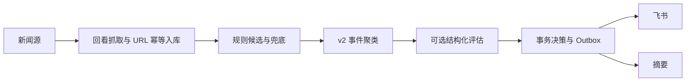

# 整体架构

Docker Compose 运行三个服务：新闻 `app`、独立 A 股 `quote_watcher`、只读 `datasette`。前两个共享 `config/common` 和通用模块，各自使用数据库与心跳文件。

## 新闻数据流

v0.7.1 仅接受 `pipeline.mode: v2`，默认 `llm.enabled=false`；评估关闭或失败时继续规则兜底。`v2_state` 驱动事件处理，旧 `status` 和历史表保留。此分支用于提前完成清理开发，生产发布仍须达到 [稳定门槛](operations/staged-cleanup.md)。

## A 股盯盘

腾讯个股快照 → tick 缓存 → 阈值/指标/事件/持仓规则 → `_alert` 飞书频道；东财 clist 全市场与板块扫描提供额外异动候选。Sina 作为可配置个股替代源，日 K 缓存仍使用 akshare。新闻灰度不改变盯盘处理。

## 共用边界与运行控制

`shared` 提供契约、配置通用能力、时间、交易日历、日志、心跳、Bark 和 pusher；新闻内容构建在 `deliver/cards.py`。新闻库保存事件、证据、决策、费用和持久投递，限速/重试跨重启生效。心跳只判断进程活性，源可用性与投递结果分别检查。

旧多层 LLM、classifier/router、commands/charts、标题 simhash 与新闻热加载已经从本分支移除。盯盘日 K 与 alerts reloader 保留；需要 legacy/shadow 回滚时使用保留的 v0.7.0 镜像和配置。

## 后续阅读

- [部署与灰度](getting-started/deployment-current.md)
- [新闻子系统](subsystems/news_pipeline.md) · [盯盘配置](quote_watcher/getting_started.md)
- [事件](components/dedup.md) · [Assessment](components/llm-pipeline.md) · [Outbox](components/dispatch-router.md)
