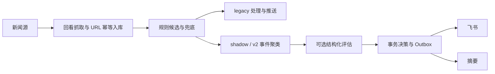

# 整体架构

Docker Compose 运行三个服务：新闻 `app`、独立 A 股 `quote_watcher`、只读 `datasette`。前两个共享 `config/common` 和通用模块，各自使用数据库与心跳文件。

## 新闻数据流

默认 `legacy`、`llm.enabled=false`。shadow 同时运行两条路径，旧路径发新闻，新事件/摘要只记 shadow；运维卡片照常发送。v2 关闭旧处理，评估关闭/失败时继续规则兜底。原始旧 `status` 和新 `v2_state` 独立，避免灰度互相抢占。

## A 股盯盘

腾讯个股快照 → tick 缓存 → 阈值/指标/事件/持仓规则 → `_alert` 飞书频道；东财 clist 全市场与板块扫描提供额外异动候选。Sina 作为可配置个股替代源，日 K 缓存仍使用 akshare。新闻灰度不改变盯盘处理。

## 共用边界与运行控制

`shared` 提供契约、配置通用能力、时间、交易日历、日志、心跳、Bark 和 pusher；新闻内容构建在 `deliver/cards.py`。新闻库保存事件、证据、决策、费用和持久投递，限速/重试跨重启生效。心跳只判断进程活性，源可用性与投递结果分别检查。

旧 LLM、classifier/router、commands/charts 和新闻热加载保留到 [稳定门槛](operations/staged-cleanup.md)，不会仅因目录存在就自动启动。

## 后续阅读

- [部署与灰度](getting-started/deployment-current.md)
- [新闻子系统](subsystems/news_pipeline.md) · [盯盘配置](quote_watcher/getting_started.md)
- [事件](components/dedup.md) · [Assessment](components/llm-pipeline.md) · [Outbox](components/dispatch-router.md)
