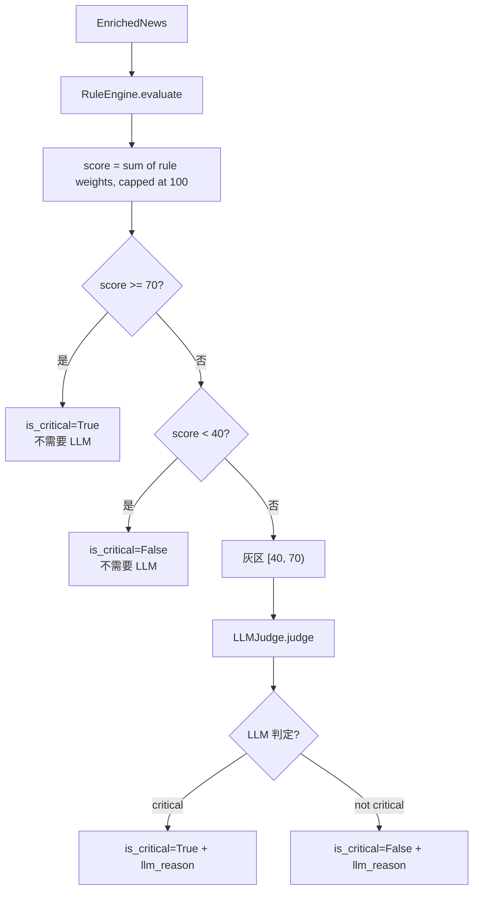

# Classifier

这一页解释新闻重要性评分的两级机制：规则引擎打分，以及灰区由 LLM judge 兜底。

---

## 整体流程



---

## 规则引擎

`RuleEngine` 对 `EnrichedNews` 评估一组规则，每条命中规则贡献一个权重分：

| 规则名 | 触发条件 | 权重 |
|---|---|---|
| `first_party_source` | source 在 `sources_always_critical` 列表内（`sec_edgar`、`juchao`） | 30 |
| `sentiment_high` | magnitude=high AND sentiment in (bullish, bearish) | 40 |
| `event_earnings` | event_type = earnings | 20 |
| `event_m_and_a` | event_type = m_and_a | 20 |
| `event_downgrade` | event_type = downgrade | 20 |
| `event_upgrade` | event_type = upgrade | 20 |
| `filing` | event_type = filing | 25 |

总分 = 所有命中权重之和，最高 100（`min(100, sum(weights))`）。

### 配置示例

```yaml
# config/app.yml
classifier:
  rules:
    price_move_critical_pct: 5.0         # 暂未在规则引擎里使用（预留）
    sources_always_critical: [sec_edgar, juchao]
    sentiment_high_magnitude_critical: true
  llm_fallback_when_score: [40, 70]      # [lo, hi) 灰区范围
```

### 分数示例

- SEC 公告（`juchao`）+ earnings → 30 + 20 = **50** → 灰区 → LLM judge
- SEC 公告（`juchao`）+ earnings + bullish + high → 30 + 20 + 40 = **90** → is_critical=True（直接）
- 普通新闻，sentiment=neutral → 0 → is_critical=False（直接）

---

## LLM Judge（灰区兜底）

当 score 落在 `[40, 70)` 区间时，调用 `LLMJudge.judge()`：

```python
class LLMJudge:
    def __init__(self, *, client: LLMClient, model: str) -> None:
        ...

    async def judge(
        self, e: EnrichedNews, *, watchlist_tickers: list[str]
    ) -> tuple[bool, str]:
        # 用 tier1_model（deepseek-v3）做判定
        # 返回 (is_critical: bool, reason: str)
```

LLM judge 使用 Tier-1 模型（DeepSeek-V3），成本极低（约 ¥0.0003/次）。返回的 `reason` 字符串存入 `news_processed.llm_reason` 字段，便于审计。

---

## is_critical 的含义

`is_critical=True` 触发两件事：

1. `DispatchRouter` 返回 `immediate=True` → `BurstSuppressor` 检查通过后立即推送
2. 如果 `charts.auto_on_critical=true`，触发 K 线图生成

`is_critical=False` 的新闻进入 Digest 缓冲区，在早晚固定时间汇总推送。

---

## ScoredNews 数据结构

```python
class ScoredNews:
    enriched: EnrichedNews    # 原始 LLM 提取结果
    score: float              # 规则总分 (0-100)
    is_critical: bool         # 最终判定
    rule_hits: list[str]      # 命中的规则名列表
    llm_reason: str | None    # 灰区时 LLM judge 的理由
```

存储在 `news_processed` 表中。

---

## 调试建议

查看某条新闻为什么是/不是 critical：

```bash
sqlite3 data/news.db "
SELECT np.is_critical, np.score, np.rule_hits, np.llm_reason, rn.title
FROM news_processed np
JOIN raw_news rn ON rn.id = np.raw_id
ORDER BY np.extracted_at DESC
LIMIT 10;"
```

---

## 相关

- [Components → LLM Pipeline](llm-pipeline.md) — 如何生成 EnrichedNews
- [Components → Dispatch Router](dispatch-router.md) — is_critical 如何影响推送路径
- [Reference → DB Schema](../reference/db-schema.md) — news_processed 表结构
