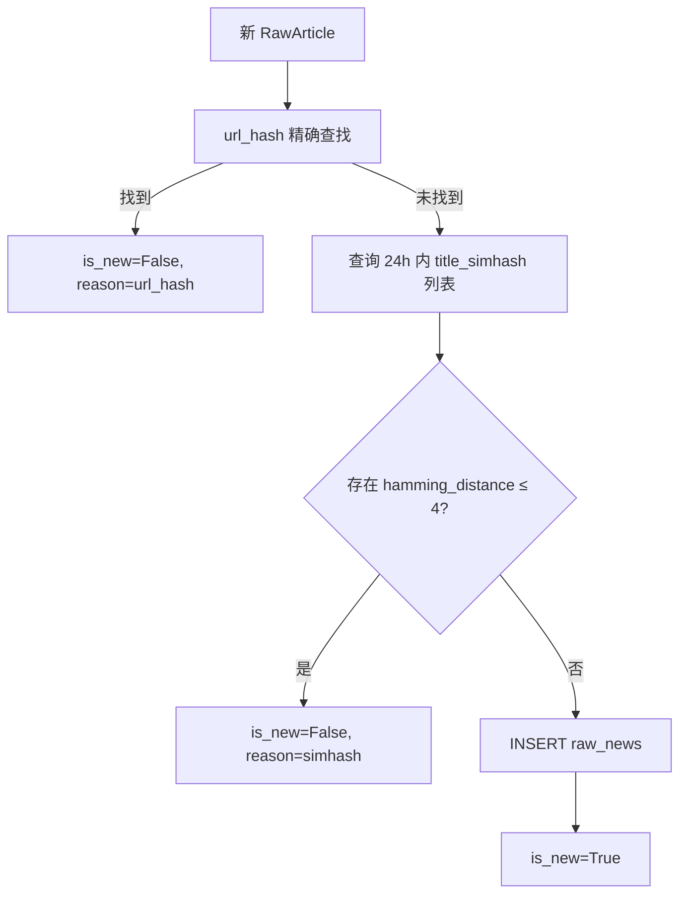

# Deduplication

这一页解释去重的两层机制：URL 精确匹配和 SimHash 模糊标题匹配。

---

## 为什么需要去重

财经新闻有两种常见重复模式：

1. **完全相同 URL**：同一篇文章被多次抓取（如 Finnhub 同一篇文章在不同分类里出现）
2. **相同内容，不同 URL**：同一事件被不同媒体转载，标题几乎一致但 URL 不同（如"NVDA 财报超预期"同时出现在 Finnhub 和雪球）

对于投资者来说，同一条信息收到 3 遍通知比漏掉信息更令人烦躁。

---

## 两层去重流程



---

## 第一层：URL Hash 精确匹配

```python
def url_hash(url: str) -> str:
    return hashlib.sha1(url.encode("utf-8")).hexdigest()
```

- 对原始 URL 字符串做 SHA-1，生成 40 位十六进制字符串
- `raw_news.url_hash` 字段有 `UNIQUE` 约束（数据库层强制去重）
- 优先级最高，成本最低（单次主键查找）

---

## 第二层：SimHash 模糊标题匹配

SimHash 是一种局部敏感哈希，相似文本生成的哈希值在汉明距离上也相近。

### 计算方式

```python
def title_simhash(title: str) -> int:
    # 用字符 bigram（2-gram）作为特征
    # 对中文和英文都有效（字符级 bigram 不依赖分词）
    text = title.strip()
    tokens = [text[i:i+2] for i in range(len(text) - 1)] or [text]
    return int(Simhash(tokens, f=64).value)  # 64-bit 整数
```

**字符 bigram 示例**：
- `"NVDA 财报超预期"` → `["NV", "VD", "DA", " 财", "财报", "报超", "超预", "预期"]`
- 中英文混合文本也能处理，不需要分词器

### 汉明距离

```python
def hamming(a: int, b: int) -> int:
    return bin(a ^ b).count("1")  # 两个 64-bit 整数不同位的数量
```

**示例**：
- `"NVDA 财报超预期"` vs `"英伟达财报超出市场预期"` → hamming ≈ 5–8（不同词，不视为重复）
- `"NVDA 财报超预期"` vs `"NVDA 财报大幅超预期"` → hamming ≈ 2–3（视为重复）

### 查询范围

去重只对 **24 小时内**的文章做 SimHash 比较：
- 超过 24 小时的老文章不参与比较，避免把相关但不同时间的新闻误判为重复
- 通过 `idx_raw_simhash` 索引加速 simhash 列的查询

---

## distance=4 的含义

`config/app.yml` 中设定：

```yaml
dedup:
  title_simhash_distance: 4
```

!!! note "distance=4 偏紧"
    64 位 SimHash 中，汉明距离 4 意味着两个 hash 只有 4 位不同（差异率 6.25%）。
    这是一个相对严格的阈值：
    - **优点**：避免把只有细微差异的标题（如"超预期" vs "超出预期"）视为不同新闻
    - **代价**：标题差异较大的同一事件报道会被视为新文章（可接受，宁漏勿重）

    如果你发现漏推太多，可以把 `title_simhash_distance` 改小（如 2 或 3）。
    如果推了太多重复，可以改大（如 6 或 8）。

---

## 数据库索引

```sql
-- raw_news 上的 SimHash 查询用索引
CREATE INDEX idx_raw_simhash ON raw_news (title_simhash);
```

SimHash 本身存储为 64 位整数（`INTEGER`），占用空间极小。查询时扫描 24 小时窗口内所有 simhash 值，在内存中做汉明距离计算（Python 层）。

---

## 配置

```yaml
# config/app.yml
dedup:
  url_strict: true          # URL hash 精确去重始终启用
  title_simhash_distance: 4 # 汉明距离阈值，越小越严格
```

---

## 相关

- [Components → Storage](storage.md) — `raw_news` 表结构
- [Components → Scrapers](scrapers.md) — 数据源
