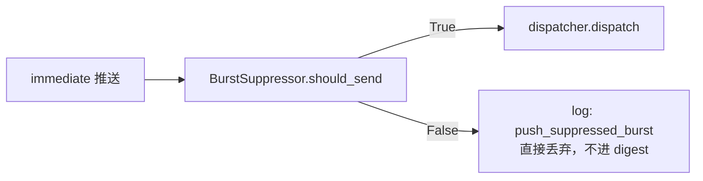

# Dispatch Router

这一页解释新闻的推送路由逻辑：immediate（实时推）vs digest（早晚汇总），以及 Burst 抑制机制。

---

## 两种推送模式

| 模式 | 触发条件 | 时效 |
|---|---|---|
| **immediate** | `is_critical=True` | 推送延迟 ≤ 处理间隔（120s） |
| **digest** | `is_critical=False` | 早晚两次固定时刻汇总 |

---

## DispatchRouter 路由逻辑

```python
class DispatchRouter:
    def route(self, scored: ScoredNews, msg: CommonMessage) -> list[DispatchPlan]:
        channels = self._by_market.get(msg.market.value, [])
        if not channels:
            return []
        return [
            DispatchPlan(
                message=msg,
                channels=channels,
                immediate=scored.is_critical,   # 关键判定
            )
        ]
```

Channel 按 market 分组（在 `main.py` 启动时按 `channels.yml` 构建）：
- `us` → `[feishu_us]`
- `cn` → `[feishu_cn]`

---

## Burst Suppressor（防刷屏）

`BurstSuppressor` 防止同一 ticker 在短时间内被反复实时推送：

```python
class BurstSuppressor:
    def __init__(self, *, window_seconds: int, threshold: int) -> None:
        self._win = window_seconds    # 默认: 5 * 60 = 300 秒
        self._th = threshold          # 默认: 3 条

    def should_send(self, tickers: list[str]) -> bool:
        # 对每个 ticker：检查过去 window 秒内发过几条
        # 任意 ticker 超过 threshold → 返回 False（抑制）
        # 只有真正发送时才追加时间戳（避免永久抑制）
```

配置来自 `app.yml`：

```yaml
push:
  same_ticker_burst_window_min: 5    # 滑动窗口 5 分钟
  same_ticker_burst_threshold: 3     # 每个 ticker 每 5 分钟最多推 3 条
```

**重要修复（v0.1.3 I8）**：抑制时不追加时间戳。原始 bug：连续被抑制的尝试会不断延伸窗口，导致永久抑制。修复后：窗口自然过期，5 分钟后自动解除。



!!! note "被 Burst 抑制的新闻不会进 Digest"
    Burst 抑制发生在 immediate 路径。被抑制的新闻直接丢弃（不是推迟到 digest）。
    这是设计选择：如果同一 ticker 5 分钟内已推了 3 条，再加 1 条 digest 也是噪音。

---

## Digest 缓冲区

非 critical 新闻进入 `digest_buffer` 表：

```python
await digest_dao.enqueue(
    news_id=proc_id,
    market=art.market.value,
    scheduled_digest=_choose_digest_key(art.market, utc_now()),
)
```

`_choose_digest_key` 根据市场本地时间决定目标 digest：
- 本地时间 < 12:00 → `morning_{market}`
- 本地时间 >= 12:00 → `evening_{market}`

每天四次 cron job 消费 digest_buffer，汇总推送：

| Digest key | 触发时刻（本地） |
|---|---|
| `morning_cn` | 08:30 CST |
| `evening_cn` | 21:00 CST |
| `morning_us` | 21:00 CST（相当于美股盘前） |
| `evening_us` | 04:30 CST（次日，相当于美股盘后） |

---

## 推送计划数据结构

```python
class DispatchPlan:
    message: CommonMessage    # 格式化好的消息
    channels: list[str]       # 目标 channel IDs
    immediate: bool           # True=实时, False=进入 digest
```

---

## 相关

- [Components → Pushers](pushers.md) — TG / 飞书 消息发送
- [Components → Scheduler](scheduler.md) — Digest cron 时刻
- [Components → Classifier](classifier.md) — is_critical 判定
