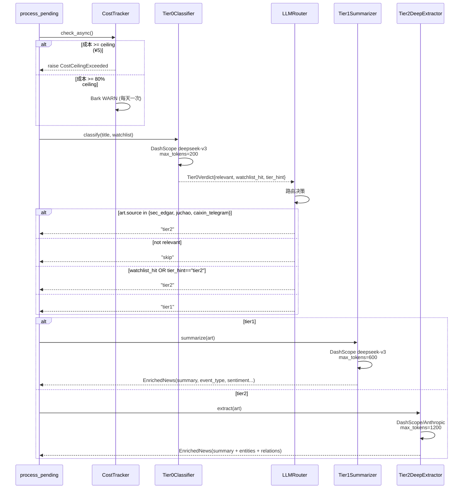

# LLM Pipeline

这一页是文档中最关键的一章：详解四层 LLM 路由、当前 fallback 状态、成本追踪熔断机制、prompt 管理，以及 Pydantic 枚举容错。

---

## 当前运行状态：全程 DeepSeek

!!! warning "Anthropic 未配置，自动 fallback"
    当前生产环境 `secrets.yml` 中 `anthropic_api_key` 为 `REPLACE_ME`（未配置）。
    启动时会输出一行 WARN 日志：

    ```
    anthropic_not_configured_fallback_to_tier1 tier2_configured=claude-haiku-4-5-20251001 fallback_model=deepseek-v3
    ```

    效果：Tier-2 和 Tier-3 的请求全部路由到 DashScope，使用 `deepseek-v3`。
    代价：实体/关系抽取质量稍差，但管线正常运行，月成本 ¥10–30。

    配置 Anthropic 见 [Operations → Secrets § Anthropic](../operations/secrets.md)。

---

## 四层模型表

| 层 | 触发条件 | 配置模型 | 实际运行（无 Anthropic） | 输入 tokens | 输出 tokens | 单次成本（DeepSeek） |
|---|---|---|---|---|---|---|
| **Tier-0** | 每条 pending 文章 | `deepseek-v3` | `deepseek-v3` | ~300 | ~100 | ¥0.00031 |
| **Tier-1** | 非一手源 + 相关 + 普通 | `deepseek-v3` | `deepseek-v3` | ~800 | ~300 | ¥0.00085 |
| **Tier-2** | 一手源 / watchlist hit / tier2 hint | `claude-haiku-4-5-20251001` | `deepseek-v3` | ~1500 | ~600 | ¥0.00165 |
| **Tier-3** | （保留，未在主管线使用） | `claude-sonnet-4-6` | `deepseek-v3` | ~2000 | ~800 | ¥0.00220 |

DeepSeek-V3 定价（阿里云 DashScope）：
- 输入：¥0.5 / 1M tokens
- 输出：¥1.5 / 1M tokens

---

## 一条新闻的 LLM 流程图



---

## 路由决策表

`LLMRouter.decide()` 按以下优先级顺序决策：

| 优先级 | 条件 | 路由结果 |
|---|---|---|
| 1（最高） | `art.source` 是一手源（`sec_edgar` / `juchao` / `caixin_telegram`） | `tier2` |
| 2 | `verdict.relevant == False` | `skip` |
| 3 | `verdict.watchlist_hit == True` OR `verdict.tier_hint == "tier2"` | `tier2` |
| 4（默认） | 其余 | `tier1` |

一手源直达 Tier-2 的原因：这些是官方公告和一手资讯，质量高，值得深度抽取。

---

## Prompt Cache 机制

```yaml
# config/app.yml
llm:
  enable_prompt_cache: true
```

- **Anthropic**：支持 prompt cache，system prompt 命中 90% 折扣。`cache_segments: [system]` 在所有 prompt YAML 中已配置，命中率约 80–90%
- **DeepSeek（DashScope）**：不支持 Anthropic 格式的 prompt cache。当前 fallback 到 DeepSeek 后，`cache_segments` 字段被传入 `LLMRequest` 但 DashScope client 忽略它——无副作用，只是不起作用

---

## Cost Tracker 熔断流程

`CostTracker` 在每条文章进入 LLM 处理前调用 `check_async()`：

```mermaid
flowchart TD
    A[check_async 被调用] --> B{今日成本 >= ceiling?}
    B -->|是 ¥5| C[Bark URGENT 告警]
    C --> D[raise CostCeilingExceeded]
    D --> E[文章标记 dead, 不再 LLM 处理]
    B -->|否| F{今日成本 >= 80% ceiling?}
    F -->|是 ¥4| G{今天已发过 warn?}
    G -->|否| H[Bark WARN 告警]
    H --> I[_warned_today.add(today)]
    G -->|是| J[跳过，避免重复告警]
    F -->|否| K[正常处理]
```

`CostTracker.record()` 在每次 LLM 调用完成后记录实际 token 消耗：

```python
def record(self, *, model: str, usage: TokenUsage) -> None:
    p = self._pricing.get(model)  # 查 PRICING 字典
    cost = (usage.input_tokens / 1_000_000) * p.input_per_m_cny + \
           (usage.output_tokens / 1_000_000) * p.output_per_m_cny
    with self._lock:  # threading.Lock 保证线程安全
        self._daily_total[date_key] += cost
```

当前 ceiling：¥5/天（`config/app.yml → runtime.daily_cost_ceiling_cny`）。

---

## Prompt 文件结构

```
config/prompts/
├── tier0_classify.v1.yaml     # 标题分类 prompt
├── tier1_summarize.v1.yaml    # 普通摘要 prompt
├── tier2_extract.v1.yaml      # 深度实体/关系抽取 prompt
└── tier3_deep_analysis.v1.yaml # 深度分析（保留）
```

版本 pin 在 `config/app.yml`：

```yaml
llm:
  prompt_versions:
    tier0_classify: v1
    tier1_summarize: v1
    tier2_extract: v1
    tier3_deep_analysis: v1
```

升级 prompt 的安全流程：
1. 新建文件 `tier1_summarize.v2.yaml`（不改动 v1）
2. 在测试环境改 `prompt_versions.tier1_summarize: v2`
3. 用 eval set（`tests/eval/`）验证 F1 不下降
4. 确认后推到生产，改 `prompt_versions`，重启服务

---

## Pydantic 输出校验 + 枚举容错

LLM 返回 JSON 后，通过 `safe_*` 辅助函数做枚举 coercion（宽松兼容）：

```python
# common/enums.py

def safe_event_type(value: str | None) -> EventType:
    if value is None:
        return EventType.OTHER
    try:
        return EventType(value.lower())
    except (ValueError, AttributeError):
        return EventType.OTHER  # fallback 而非 crash
```

同样的模式用于 `safe_sentiment`、`safe_magnitude`、`safe_predicate`、`safe_entity_type`。

**为什么需要这个**：LLM 有 5-10% 的概率返回不在枚举定义内的值，例如：
- `"market_analysis"` 不是合法 `EventType` → coerce 为 `EventType.OTHER`
- `"neutral_to_positive"` 不是合法 `Sentiment` → coerce 为 `Sentiment.NEUTRAL`

这避免了整条新闻因为一个 enum 字段验证失败而进入 dead letter。

---

## client_selection：Anthropic 可选路由

```python
# llm/client_selection.py

def pick_client_and_model(
    configured_model: str,
    *,
    anthropic_client: LLMClient | None,
    dashscope_client: LLMClient,
    tier1_fallback_model: str,
) -> tuple[LLMClient, str]:
    if configured_model.startswith("claude-"):
        if anthropic_client is not None:
            return anthropic_client, configured_model
        return dashscope_client, tier1_fallback_model  # fallback
    return dashscope_client, configured_model
```

在 `main.py` 启动时调用一次，决定 Tier-2 和 Tier-3 使用哪个 client。

---

## 如何换到 Anthropic

1. 申请 Anthropic API key（见 [Operations → Secrets § Anthropic](../operations/secrets.md)）
2. 填入 `config/secrets.yml → llm.anthropic_api_key`
3. 重启服务：`sudo systemctl restart news-pipeline`
4. 确认启动日志没有 `anthropic_not_configured_fallback_to_tier1`

配置后成本会上升（Haiku ¥7/M input，vs DeepSeek ¥0.5/M），建议把 `daily_cost_ceiling_cny` 上调到 ¥15–20。

---

## 相关

- [Reference → LLM Cost](../reference/llm-cost.md) — 详细成本估算
- [Components → Classifier](classifier.md) — 打分和 LLM judge
- [Operations → Secrets](../operations/secrets.md) — 配置 API key
- [Operations → Monitoring](../operations/monitoring.md) — 查看成本
