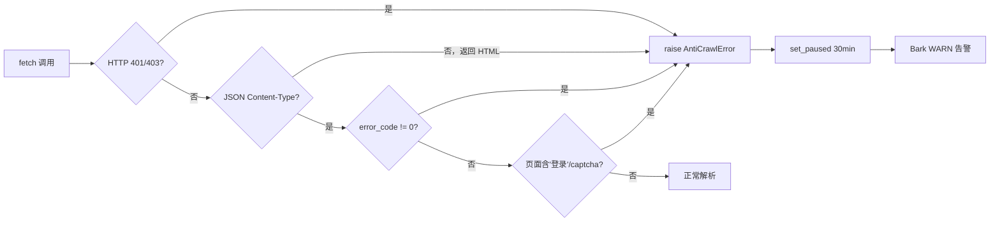

# Scrapers

这一页详解 9 个数据源 Scraper：接入方式、cookie 需求、当前启用状态，以及反爬处理机制。

---

## 数据源总览

| source_id | market | 接入方式 | 需要 cookie | 当前状态 | 间隔 |
|---|---|---|---|---|---|
| `finnhub` | US | REST API（token） | 否 | **enabled** | 300s |
| `sec_edgar` | US | RSS/Atom feed | 否 | **enabled** | 120s |
| `caixin_telegram` | CN | REST API（无鉴权） | 否 | **enabled** | 60s |
| `akshare_news` | CN | akshare 库 (`stock_news_em`) | 否 | **enabled** | 180s |
| `juchao` | CN | HTTP POST (cninfo.com.cn) | 否 | **enabled** | 120s |
| `yfinance_news` | US | yfinance 库 | 否 | disabled | 600s |
| `xueqiu` | CN | REST API（v4） | 是 | disabled | 300s |
| `ths` | CN | HTML 解析（BeautifulSoup） | 是 | disabled | 300s |
| `tushare_news` | CN | tushare pro API | 否（需积分） | disabled | 600s |

---

## 各源详解

### finnhub（美股新闻）

- **接入**：`GET https://finnhub.io/api/v1/news?category=general&token=...`
- **认证**：`finnhub_token` 写入 `secrets.yml → sources`
- **限频**：官方 QPS 60/min（免费版），本系统 300s 间隔，远低于限制
- **字段**：`headline`、`url`、`summary`、`datetime`（Unix 时间戳）、`source`
- **一手源**：否（走标准 Tier-0 → router 路由）

### sec_edgar（美股 SEC 公告）

- **接入**：`GET https://www.sec.gov/cgi-bin/browse-edgar?...&output=atom` — 每个 CIK 一个 Atom feed
- **认证**：无，但 User-Agent 必须包含联系邮件（SEC 政策要求）
- **CIK 映射**（硬编码在 `main.py`）：

  ```python
  sec_ciks = {
      "NVDA": "1045810",
      "TSLA": "1318605",
      "AAPL": "320193",
  }
  ```

- **重要**：`sec_edgar` 是**一手源**，所有文章直接路由到 Tier-2 深度抽取（跳过 Tier-0 分类）
- **频率**：SEC 有速率限制（10 req/s），120s 间隔充裕

### caixin_telegram（财联社）

- **接入**：`GET https://www.cls.cn/v3/depth/home/assembled/1000`
- **认证**：无需 cookie，公开 API
- **特点**：财联社是国内一手财经信息源，因此设为**一手源**，直达 Tier-2
- **间隔**：60 秒（所有源中最频繁）
- **字段**：`ctime`（Unix 时间戳）、`title`、`brief`、`shareurl`

!!! note "caixin_telegram 命名"
    命名中的 "telegram" 不是 Telegram 消息，而是历史遗留名称（财联社电报频道）。实际接入的是财联社 REST API。

### akshare_news（东方财富股票新闻）

- **接入**：`akshare.stock_news_em(ticker)` — 同步调用，用 `asyncio.to_thread` 包装
- **认证**：无需 API key，akshare 内置
- **字段**：`发布时间`（上海时区字符串）、`标题`、`内容`、`链接`
- **时区处理**：发布时间 `tz_localize("Asia/Shanghai")` → `ensure_utc` 转换

### juchao（巨潮资讯 A 股公告）

- **接入**：`POST http://www.cninfo.com.cn/new/hisAnnouncement/query`，表单参数 `{stock, tabName, pageSize, pageNum}`
- **认证**：无需鉴权
- **重要**：`juchao` 是**一手源**（A 股官方公告），直达 Tier-2
- **字段**：`announcementTitle`、`secName`、`announcementTime`（毫秒时间戳）、`adjunctUrl`

---

## 当前禁用的 4 个源

### yfinance_news（disabled）

**原因**：yfinance 库 0.2.50+ 版本更新后，新闻对象结构变更，`providerPublishTime` 字段已不存在。

**重启需要**：
1. 检查最新 yfinance 的新闻字段结构：`yf.Ticker("AAPL").news[0]` 看实际 keys
2. 更新 `scrapers/us/yfinance_news.py` 中的字段读取逻辑
3. 在 `config/sources.yml` 中改 `enabled: true`

### xueqiu（disabled）

**原因**：`/v4/statuses/stock_timeline.json` 现返回 404，API endpoint 已变更。

**重启需要**：
1. 用浏览器开发者工具抓包，找到当前雪球移动端/PC端的真实 API endpoint
2. 更新 `scrapers/cn/xueqiu.py`
3. 在 `config/secrets.yml` 填入有效的 `xueqiu_cookie`
4. 在 `config/sources.yml` 改 `enabled: true`

### ths（同花顺，disabled）

**原因**：`https://news.10jqka.com.cn/<ticker>/list.shtml` URL pattern 已变更。

**重启需要**：
1. 找到同花顺当前的新闻列表页 URL 结构
2. 更新 `scrapers/cn/ths.py` 中的 URL 和 HTML selector
3. 在 `config/secrets.yml` 填入有效的 `ths_cookie`
4. 在 `config/sources.yml` 改 `enabled: true`

### tushare_news（disabled）

**原因**：Tushare `news` API 需要 5000+ 积分（付费），个人免费账号无法调用。

**重启需要**：
1. 升级 Tushare 积分等级（或找其他付费方案）
2. 在 `config/secrets.yml` 填入 `tushare_token`
3. 在 `config/sources.yml` 改 `enabled: true`

---

## 反爬检测机制

当 HTTP 层或响应内容检测到反爬信号时，抛出 `AntiCrawlError`，触发以下流程：



触发条件（各源已实现）：
- xueqiu：HTTP 401/403 → `AntiCrawlError`；非 JSON Content-Type → `AntiCrawlError`；`error_code != 0` → `AntiCrawlError`
- ths：HTTP 401/403 → `AntiCrawlError`；空响应体 → `AntiCrawlError`；含 `登录` 或 `captcha` 关键词 → `AntiCrawlError`

暂停期间：
```python
await state_dao.set_paused(source_id, until=utc_now() + timedelta(minutes=30))
# scrape_one_source 在每次调用开始时检查 is_paused
```

---

## HTTP 公共配置

```python
# scrapers/common/http.py
def make_async_client() -> httpx.AsyncClient:
    # 固定 User-Agent，模拟浏览器
    # 超时：connect=5s, read=15s
    # 跟随重定向
```

Cookie 解析：
```python
# scrapers/common/cookies.py
def parse_cookie_string(cookie: str) -> dict[str, str]:
    # 解析 "key=value; key2=value2" 格式
    # 直接传入 httpx cookies= 参数
```

---

## 启动连通性探测

每次服务启动时，`_probe_scrapers` 对所有已注册的 scraper 发起测试抓取（`since = utc_now() - 5min`，超时 15s）：

```python
async def _probe_scrapers(reg: ScraperRegistry, bark: BarkAlerter | None) -> None:
    for sid in reg.list_ids():
        scraper = reg.get(sid)
        try:
            items = await asyncio.wait_for(scraper.fetch(since), timeout=15)
            log.info("scraper_probe_ok", source=sid, items=len(items))
        except Exception as e:
            log.warning("scraper_probe_failed", source=sid, error=str(e))
            if bark is not None:
                await bark.send(f"scraper_probe_{sid}_failed", ...)
```

探测失败不会阻止服务启动，只记录 WARNING 并发 Bark 通知。

---

## 相关

- [Components → Deduplication](dedup.md)
- [Operations → Secrets](../operations/secrets.md) — cookie 和 token 配置
- [Operations → Troubleshooting](../operations/troubleshooting.md) — cookie 过期处理
