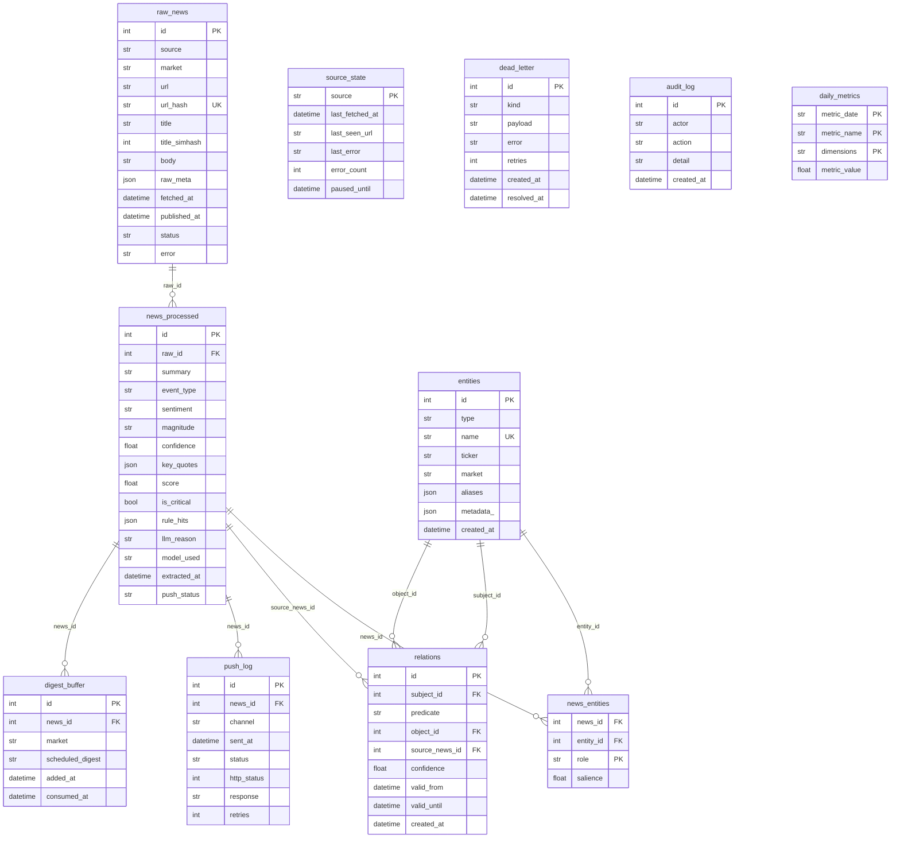

# Storage

这一页描述 SQLite 13 张表的结构、设计决策、索引策略、FTS5 全文搜索，以及用 Datasette 浏览数据的方法。

---

## 整体 ER 图



---

## 13 张表说明

| 表名 | 用途 | 保留策略 |
|---|---|---|
| `raw_news` | 抓取的原始新闻，去重门控 | 30 天热数据 |
| `news_processed` | LLM 处理结果 + 重要性评分 | 365 天 |
| `entities` | 实体词典（公司、人物等），跨新闻共用 | 永久 |
| `news_entities` | 新闻-实体多对多关系，含 role 和 salience | 跟随 news_processed |
| `relations` | 实体间关系三元组（主语-谓语-宾语） | 跟随 entities |
| `source_state` | 每个 scraper 的水位线 + 暂停状态 | 永久（每源一行） |
| `push_log` | 推送历史（每次发送一行） | 90 天 |
| `digest_buffer` | Digest 待发条目 | 自动标记 consumed |
| `dead_letter` | 失败任务清单（待人工审查） | 永久（手动 resolve） |
| `audit_log` | 操作审计（bot 命令等） | 永久 |
| `daily_metrics` | 每日抓取/LLM/推送指标 | 永久 |
| `news_fts` | FTS5 虚拟表（全文索引） | 跟随 raw_news |

---

## 图谱预留：entities / news_entities / relations

这三张表是为未来知识图谱功能预留的。当前 Tier-2 深度抽取已填充这些表，但尚未有查询/可视化 UI。

```
entities: {type: COMPANY, name: "英伟达", ticker: "NVDA", market: "us"}
news_entities: {news_id: 42, entity_id: 7, role: "subject", salience: 0.9}
relations: {subject_id: 7, predicate: "competes_with", object_id: 12, confidence: 0.8}
```

未来可以在此基础上构建：
- 供应链图谱（`supplies` 关系）
- 竞争对手识别（`competes_with`）
- 监管关系（`regulates`）

---

## 索引设计

```sql
-- raw_news
CREATE UNIQUE INDEX uq_raw_url_hash ON raw_news (url_hash);
CREATE INDEX idx_raw_status_pub ON raw_news (status, published_at);
CREATE INDEX idx_raw_market_pub ON raw_news (market, published_at);
CREATE INDEX idx_raw_simhash ON raw_news (title_simhash);

-- news_processed
CREATE UNIQUE INDEX uq_proc_raw ON news_processed (raw_id);
CREATE INDEX idx_proc_critical_extracted ON news_processed (is_critical, extracted_at);
CREATE INDEX idx_proc_push_status ON news_processed (push_status, extracted_at);

-- entities
CREATE UNIQUE INDEX uq_ent_type_name ON entities (type, name);
CREATE INDEX idx_ent_ticker ON entities (ticker);

-- relations
CREATE INDEX idx_rel_subject ON relations (subject_id, predicate);
CREATE INDEX idx_rel_object ON relations (object_id, predicate);

-- push_log
CREATE INDEX idx_pushlog_news ON push_log (news_id);
CREATE INDEX idx_pushlog_sent ON push_log (sent_at);
```

---

## FTS5 全文搜索

`news_fts` 是 SQLite FTS5 虚拟表，对 `raw_news.title` 和 `raw_news.body` 建立全文索引。

```sql
-- 搜索 NVDA 相关新闻
SELECT r.id, r.title, r.published_at
FROM news_fts
JOIN raw_news r ON r.rowid = news_fts.rowid
WHERE news_fts MATCH 'NVDA'
ORDER BY r.published_at DESC
LIMIT 10;

-- 搜索财报相关
SELECT * FROM news_fts WHERE news_fts MATCH '财报 OR earnings';
```

---

## 数据保留策略

| 层 | 保留期 | 配置字段 |
|---|---|---|
| `raw_news` 热数据 | 30 天 | `retention.raw_news_hot_days` |
| `news_processed` | 365 天 | `retention.news_processed_hot_days` |
| `push_log` | 90 天 | `retention.push_log_days` |
| entities / relations | 永久 | — |
| dead_letter | 永久，手动 resolve | — |

定期清理目前由外部脚本或手动 SQL 处理（无内置定时清理 job）。

---

## 用 Datasette 浏览数据

### 本地

```bash
# 一次性安装
uv tool install datasette

# 打开数据库
datasette data/news.db --open
# 浏览器打开 http://localhost:8001
```

### 远程服务器（SSH 隧道）

```bash
# 本机开 SSH 隧道（Datasette 在服务器上由 Docker 运行在 127.0.0.1:8001）
ssh -L 8001:localhost:8001 ubuntu@8.135.67.243

# 然后本机浏览器打开 http://localhost:8001
```

### 常用 Datasette 查询

```sql
-- 今日抓取量按源统计
SELECT source, count(*) as cnt
FROM raw_news
WHERE date(fetched_at) = date('now')
GROUP BY source
ORDER BY cnt DESC;

-- 今日 critical 新闻
SELECT rn.title, np.score, np.event_type, np.sentiment, np.is_critical
FROM news_processed np
JOIN raw_news rn ON rn.id = np.raw_id
WHERE date(np.extracted_at) = date('now')
  AND np.is_critical = 1
ORDER BY np.extracted_at DESC;

-- 查成本（从 daily_metrics）
SELECT metric_date, metric_value as cost_cny
FROM daily_metrics
WHERE metric_name = 'llm_cost_cny'
ORDER BY metric_date DESC
LIMIT 7;

-- 查死信
SELECT kind, error, retries, created_at
FROM dead_letter
WHERE resolved_at IS NULL
ORDER BY created_at DESC;
```

---

## 重要 SQL 查询

```sql
-- 检查各源最近 30 分钟抓取量
SELECT source, count(*) as cnt
FROM raw_news
WHERE fetched_at > datetime('now', '-30 minutes')
GROUP BY source;

-- 查某源暂停状态
SELECT source, paused_until, last_error
FROM source_state
WHERE paused_until > datetime('now');

-- 推送失败统计（最近 1 小时）
SELECT channel, count(*) as fails
FROM push_log
WHERE status = 'failed'
  AND sent_at > datetime('now', '-1 hour')
GROUP BY channel;
```

---

## 相关

- [Reference → DB Schema](../reference/db-schema.md) — 完整字段说明
- [Operations → Daily Ops](../operations/daily-ops.md) — 常用查询命令
- [Operations → Monitoring](../operations/monitoring.md) — Datasette 远程访问
