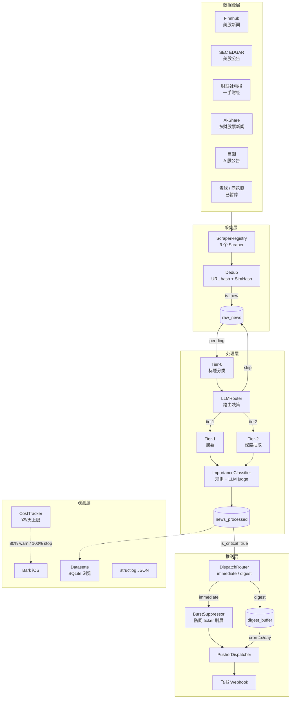
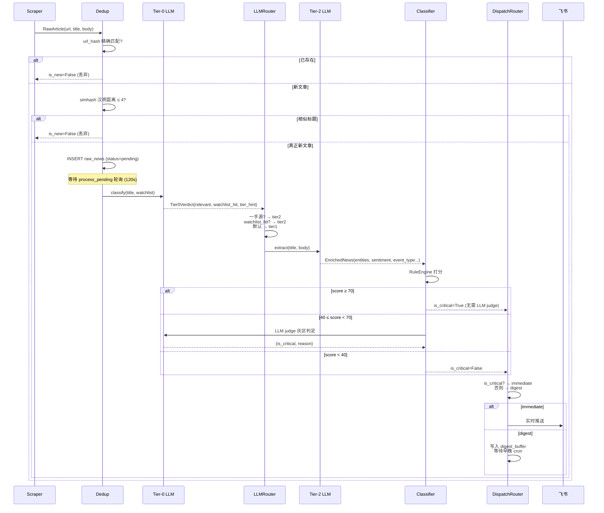

# Architecture

这一页展示系统整体架构、数据流（一条新闻的一生），以及 7 个核心模块速览。

---

## 整体架构图

---

## 数据流：一条新闻的一生

---

## 7 个核心模块速览

| 模块 | 位置 | 职责 |
|---|---|---|
| **Scrapers** | `scrapers/` | 9 个数据源适配器，统一输出 `RawArticle` |
| **Dedup** | `dedup/` | URL hash 精确去重 + SimHash 模糊去重 |
| **LLM Pipeline** | `llm/` | Tier-0/1/2/3 四层 LLM，路由 + 提取 + 成本追踪 |
| **Classifier** | `classifier/` | 规则引擎打分 + LLM judge 灰区兜底，输出 `ScoredNews` |
| **DispatchRouter** | `router/` | 决定 immediate vs digest，按 market 分配 channel |
| **Pushers** | `pushers/` | 飞书 / WeCom 发送器，Burst 抑制，消息格式化 |
| **Storage** | `storage/` | SQLite 13 表，DAOs，Alembic 迁移 |

---

## 调度时序

系统启动后 APScheduler 维护以下 jobs（全部 UTC）：

| Job | 触发方式 | 间隔/时刻 |
|---|---|---|
| `scrape_finnhub` | interval | 每 300 秒 |
| `scrape_sec_edgar` | interval | 每 120 秒 |
| `scrape_caixin_telegram` | interval | 每 60 秒 |
| `scrape_akshare_news` | interval | 每 180 秒 |
| `scrape_juchao` | interval | 每 120 秒 |
| `process_pending` | interval | 每 120 秒 |
| `digest_morning_cn` | cron | 08:30 CST |
| `digest_evening_cn` | cron | 21:00 CST |
| `digest_morning_us` | cron | 21:00 CST (美股盘前) |
| `digest_evening_us` | cron | 04:30 CST (次日，美股盘后) |
| `push_failure_alert` | interval | 每 1800 秒 |
| `bark_heartbeat` | interval | 每 86400 秒 |
| `dlq_weekly_alert` | cron | 周一 08:00 CST |

---

## 相关

- [Components → LLM Pipeline](../components/llm-pipeline.md)
- [Components → Scrapers](../components/scrapers.md)
- [Components → Storage](../components/storage.md)
- [Components → Scheduler](../components/scheduler.md)
