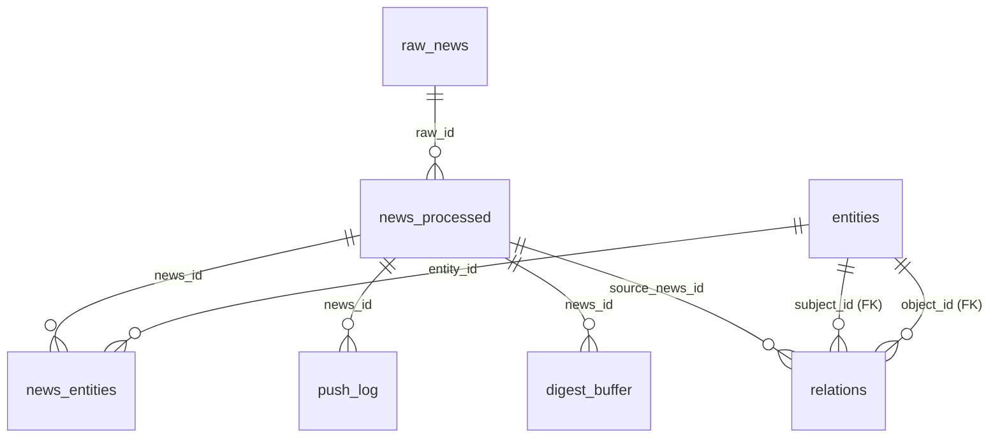

# DB Schema

这一页是 SQLite 13 张表的完整字段说明，包含 ER 图、索引，以及重要 SQL 查询示例。

---

## ER 图（简化版）



---

## raw_news

原始抓取的新闻，所有管线的入口。

| 字段 | 类型 | 约束 | 说明 |
|---|---|---|---|
| `id` | INTEGER | PK, autoincrement | — |
| `source` | TEXT | NOT NULL | scraper source_id（如 `finnhub`） |
| `market` | TEXT | NOT NULL | `us` 或 `cn` |
| `url` | TEXT | NOT NULL | 原文 URL |
| `url_hash` | TEXT | UNIQUE | SHA-1(url)，40 位十六进制 |
| `title` | TEXT | NOT NULL | 新闻标题 |
| `title_simhash` | INTEGER | DEFAULT 0 | 64-bit SimHash 整数 |
| `body` | TEXT | nullable | 正文（部分源无正文） |
| `raw_meta` | JSON | nullable | 源特定元数据（如 ticker、id） |
| `fetched_at` | DATETIME | NOT NULL | 抓取时间（naive UTC） |
| `published_at` | DATETIME | NOT NULL | 发布时间（naive UTC） |
| `status` | TEXT | DEFAULT 'pending' | `pending` / `processed` / `skipped` / `dead` |
| `error` | TEXT | nullable | status=dead 时的错误信息 |

**索引**：
```sql
UNIQUE INDEX uq_raw_url_hash (url_hash)
INDEX idx_raw_status_pub (status, published_at)    -- 查 pending 文章
INDEX idx_raw_market_pub (market, published_at)    -- 按市场时间查询
INDEX idx_raw_simhash (title_simhash)              -- SimHash 去重
```

---

## news_processed

LLM 处理结果 + 重要性评分。

| 字段 | 类型 | 约束 | 说明 |
|---|---|---|---|
| `id` | INTEGER | PK | — |
| `raw_id` | INTEGER | FK → raw_news.id, UNIQUE | 一对一 |
| `summary` | TEXT | NOT NULL | LLM 生成的摘要 |
| `event_type` | TEXT | NOT NULL | `earnings`/`m_and_a`/`policy`/`price_move`/`downgrade`/`upgrade`/`filing`/`other` |
| `sentiment` | TEXT | NOT NULL | `bullish`/`bearish`/`neutral` |
| `magnitude` | TEXT | NOT NULL | `low`/`medium`/`high` |
| `confidence` | REAL | NOT NULL | LLM 置信度 0.0-1.0 |
| `key_quotes` | JSON | nullable | 关键引述列表 |
| `score` | REAL | NOT NULL | 规则引擎总分 0-100 |
| `is_critical` | BOOLEAN | NOT NULL | 是否关键（决定推送路径） |
| `rule_hits` | JSON | nullable | 命中的规则名列表 |
| `llm_reason` | TEXT | nullable | 灰区 LLM judge 的理由 |
| `model_used` | TEXT | NOT NULL | 使用的 LLM 模型名 |
| `extracted_at` | DATETIME | NOT NULL | 处理完成时间（naive UTC） |
| `push_status` | TEXT | DEFAULT 'pending' | 推送状态 |

**索引**：
```sql
UNIQUE INDEX uq_proc_raw (raw_id)
INDEX idx_proc_critical_extracted (is_critical, extracted_at)
INDEX idx_proc_push_status (push_status, extracted_at)
```

---

## entities

LLM 从新闻中抽取的实体词典，跨新闻复用。

| 字段 | 类型 | 说明 |
|---|---|---|
| `id` | INTEGER PK | — |
| `type` | TEXT | `company`/`person`/`event`/`sector`/`policy`/`product` |
| `name` | TEXT | 实体名称（主名称） |
| `ticker` | TEXT | 股票代码（可选） |
| `market` | TEXT | `us`/`cn`（可选） |
| `aliases` | JSON | 别名列表（如 `["英伟达", "NVIDIA Corp"]`） |
| `metadata_` | JSON | 扩展元数据 |
| `created_at` | DATETIME | 首次发现时间 |

**约束**：`UNIQUE(type, name)` — 同类型+名称不重复。

---

## news_entities

新闻-实体多对多关系表。

| 字段 | 类型 | 说明 |
|---|---|---|
| `news_id` | INTEGER PK+FK | → news_processed.id |
| `entity_id` | INTEGER PK+FK | → entities.id |
| `role` | TEXT PK | 实体在该新闻中的角色（如 `subject`、`object`、`mentioned`） |
| `salience` | REAL | 显著度 0.0-1.0 |

---

## relations

实体间关系三元组（主语-谓语-宾语）。

| 字段 | 类型 | 说明 |
|---|---|---|
| `id` | INTEGER PK | — |
| `subject_id` | INTEGER FK | → entities.id |
| `predicate` | TEXT | `supplies`/`competes_with`/`owns`/`regulates`/`partners_with`/`mentions` |
| `object_id` | INTEGER FK | → entities.id |
| `source_news_id` | INTEGER FK | → news_processed.id（关系来源） |
| `confidence` | REAL | LLM 置信度 0.0-1.0 |
| `valid_from` | DATETIME | 关系有效起始时间（可选） |
| `valid_until` | DATETIME | 关系有效终止时间（可选） |
| `created_at` | DATETIME | 记录创建时间 |

---

## source_state

每个 scraper 的运行状态（每源一行）。

| 字段 | 类型 | 说明 |
|---|---|---|
| `source` | TEXT PK | scraper source_id |
| `last_fetched_at` | DATETIME | 最近一次成功抓取时间 |
| `last_seen_url` | TEXT | 最近看到的文章 URL |
| `last_error` | TEXT | 最近一次错误信息 |
| `error_count` | INTEGER | 累计错误次数 |
| `paused_until` | DATETIME | 暂停截止时间（NULL = 未暂停） |

---

## push_log

每次推送操作的日志。

| 字段 | 类型 | 说明 |
|---|---|---|
| `id` | INTEGER PK | — |
| `news_id` | INTEGER FK | → news_processed.id |
| `channel` | TEXT | channel_id（如 `feishu_us`） |
| `sent_at` | DATETIME | 发送时间 |
| `status` | TEXT | `ok` / `failed` |
| `http_status` | INTEGER | HTTP 状态码（可选） |
| `response` | TEXT | API 响应体（可选，用于调试） |
| `retries` | INTEGER | 重试次数 |

---

## digest_buffer

待汇总推送的新闻缓冲区。

| 字段 | 类型 | 说明 |
|---|---|---|
| `id` | INTEGER PK | — |
| `news_id` | INTEGER FK | → news_processed.id（UNIQUE） |
| `market` | TEXT | `us` / `cn` |
| `scheduled_digest` | TEXT | 目标 digest key（如 `morning_cn`） |
| `added_at` | DATETIME | 入队时间 |
| `consumed_at` | DATETIME | 消费时间（NULL = 待处理） |

---

## dead_letter

失败任务清单。

| 字段 | 类型 | 说明 |
|---|---|---|
| `id` | INTEGER PK | — |
| `kind` | TEXT | 失败类型（如 `scrape`、`push_4xx`） |
| `payload` | TEXT | 失败时的输入数据（JSON 序列化） |
| `error` | TEXT | 错误信息 |
| `retries` | INTEGER | 已重试次数 |
| `created_at` | DATETIME | 记录时间 |
| `resolved_at` | DATETIME | 解决时间（NULL = 未解决） |

---

## audit_log

操作审计日志（Bot 命令等）。

| 字段 | 类型 | 说明 |
|---|---|---|
| `id` | INTEGER PK | — |
| `actor` | TEXT | 操作者（如 `tg:123456789`） |
| `action` | TEXT | 操作名称（如 `watch`、`pause`） |
| `detail` | TEXT | 操作详情 |
| `created_at` | DATETIME | 操作时间 |

---

## daily_metrics

每日聚合指标（计数器模式）。

| 字段 | 类型 | 说明 |
|---|---|---|
| `metric_date` | TEXT PK | ISO 日期（`2026-04-25`） |
| `metric_name` | TEXT PK | 指标名（如 `scrape_new`、`llm_cost_cny`） |
| `dimensions` | TEXT PK | 维度（如 `source=finnhub`，空字符串表示无维度） |
| `metric_value` | REAL | 指标值（累计） |

---

## 重要 SQL 查询示例

```sql
-- 今日新闻流量
SELECT source, count(*) as cnt, sum(CASE WHEN status='processed' THEN 1 ELSE 0 END) as processed
FROM raw_news WHERE date(fetched_at) = date('now')
GROUP BY source;

-- 最近 critical 新闻（含原标题和摘要）
SELECT rn.title, np.sentiment, np.magnitude, np.score, np.extracted_at
FROM news_processed np
JOIN raw_news rn ON rn.id = np.raw_id
WHERE np.is_critical = 1
ORDER BY np.extracted_at DESC LIMIT 20;

-- NVDA 相关实体和关系
SELECT e1.name, r.predicate, e2.name, r.confidence
FROM relations r
JOIN entities e1 ON e1.id = r.subject_id
JOIN entities e2 ON e2.id = r.object_id
WHERE e1.ticker = 'NVDA' OR e2.ticker = 'NVDA'
ORDER BY r.confidence DESC LIMIT 20;

-- 本周推送统计
SELECT channel, status, count(*) cnt
FROM push_log
WHERE sent_at >= datetime('now', 'weekday 0', '-7 days')
GROUP BY channel, status;

-- 未解决死信
SELECT kind, count(*) cnt, max(created_at) last_seen
FROM dead_letter WHERE resolved_at IS NULL
GROUP BY kind;
```

---

## 相关

- [Components → Storage](../components/storage.md) — 存储设计和 Datasette 使用
- [Reference → Config Schema](config-schema.md) — AppConfig 字段
