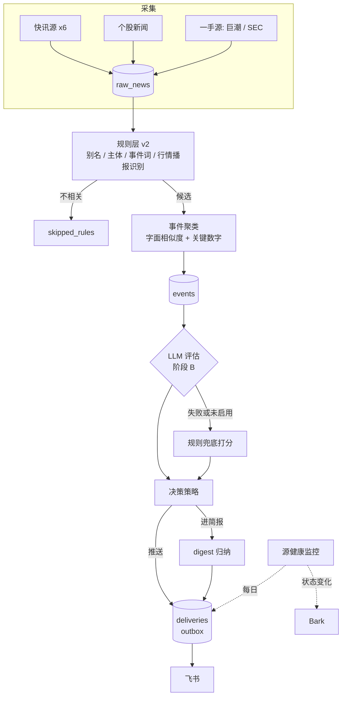

# 新闻流水线优化改造 — 详细设计与开发文档

- **作者**：qingbin（Claude 起草，文中的"我"指起草者，"你"指 qingbin）
- **日期**：2026-10-06
- **状态**：Draft（待评审；评审通过后按阶段拆 implementation plan）
- **目标版本**：v0.6.0（阶段 A）→ v0.7.0（阶段 B）→ v0.7.1（阶段 C）→ v0.8.x（阶段 D）
- **关系**：在 `2026-04-25-news-pipeline-design.md`、`2026-04-26-watchlist-rules-design.md`、`2026-05-08-quote-watcher-design.md` 三份设计之上的改造。与原设计冲突处以本文为准，冲突点列在 §12。
- **依据**：2026-10-06 生产审计，方法见 §0.1 末尾。

---

## 0. 一句话目标

线上现在实际是"4 个通用快讯源 + 关键词过滤 + 正文截前 200 字转发"。本次改造把它变成：一手源和快讯并重，多源报道合并成事件，按"对持仓的实质性"决定推不推，digest 变成归纳过的简报，并且任何一个环节失效都能在小时级被发现。

## 0.1 现状与问题

下表每一条都有实测证据。"位置"列是当前代码里的出处。

| # | 问题 | 证据 | 位置 |
|---|---|---|---|
| P1 | 水位线逻辑导致系统性漏抓 | 东财快讯最近 16 小时 197 条里有 20 条（10%）既没入库也不是被去重掉的；Finnhub general 频道当前 100 条里 0 条在库 | `src/news_pipeline/scheduler/jobs.py:119-124`、`:182-184`，以及各 scraper 里的 `if ts < since: continue` |
| P2 | 13 个源里 6 个没有有效产出，另有 Finnhub 每天只有约 2 条；只有财联社一个在报警 | 见 §2.2 逐源表 | 各 scraper |
| P3 | 即时推送的条件与事件实质性无关 | 实际条件是"提到自选股 + 同条出现板块词"（50+20=70 分）。英伟达追加 1500 亿美元回购，4 个源 8 条快讯全部 50 分进 digest，两小时后才有一条碰巧带"芯片"的改写稿被推送 | `src/news_pipeline/rules/engine.py:95-103`、`src/news_pipeline/classifier/importance.py:44` |
| P4 | 关键词既太宽又太窄，短别名认错公司 | 放行的文章只有 13.5% 提到自选股，70.8% 靠单个泛词进来；含"美联储"的 2062 条丢了 73%；含"谷歌"的 480 条有 78% 没识别成 GOOGL；"药明"匹配到药明巨诺、"中芯"匹配到"其中芯片" | `config/news_pipeline/watchlist.yml` |
| P5 | 去重无效，且同一条新闻推两个群 | 推送里 17.1% 是重复（几乎全是跨源）；重复对的标题 simhash 距离没有一对 ≤ 4；53% 的新闻同时推到美股群和 A 股群 | `src/news_pipeline/dedup/dedup.py:25-27`、`src/news_pipeline/router/routes.py:23` |
| P6 | digest 只发最早的 30 条，其余丢弃 | 工作日每期发出的是 22–24 小时前的内容；9/30 晚报排队 597 条，发 30 条，丢 567 条 | `src/news_pipeline/main.py:430-433`、`src/news_pipeline/scheduler/jobs.py:90-100` |
| P7 | 被突发抑制的推送直接丢失 | 近 30 天 1538 条应推送里有 136 条既没推也没进 digest | `src/news_pipeline/scheduler/jobs.py:314-316` |
| P8 | 没有分析层 | 14.5 万条已处理新闻全部 `rules-only`；配置里的 `deepseek-v3` 已不在账号可用模型列表中，直接打开 `llm.enable` 大概率会报错 | `config/common/app.yml`、`config/news_pipeline/watchlist.yml:151` |
| P9 | 可观测性缺失 | healthcheck 只要任一源在抓就通过；财联社每 15 分钟一条 Bark 已持续四个多月（约 80 条/天）；quote_watcher 上线后没有任何成功取数的痕迹 | `src/news_pipeline/healthcheck.py:21-24`、`src/shared/observability/alert.py` |
| P10 | quote_watcher 取不到数 | 新浪行情接口对服务器 IP 返回 403，约 5.2 秒后才返回，超时设的是 5 秒，所以日志里错误为空 | `src/quote_watcher/feeds/sina.py:65` |
| P11 | 设计与实现落差大 | bot 命令、图表、实体关系三张表、死信写入、热加载、数据保留都没接上；约 10 个配置项零引用；近三成 `news_pipeline` 代码线上没在跑 | 见 §4.1 |
| P12 | 小项 | httpx INFO 日志把飞书 webhook、Bark 地址写进容器日志；`.gitignore` 忽略的是 `config/secrets.yml`，实际文件在 `config/common/secrets.yml`，服务器上 `git status` 显示它是未跟踪文件；两个容器启动时都会跑 `alembic upgrade head` | `src/shared/observability/log.py`、`.gitignore`、`docker/entrypoint.sh` |

**审计方法**：读完主链路代码；对生产库 `news.db` 做只读统计；把 2026-09-14 至 10-06 的 59,088 条原始新闻拉到本地，用项目自己的规则引擎回放（与线上结果 17,536 条零偏差）；从生产容器里逐个实测上游接口（附录 A）。本文里的方案参数（词表、阈值、合并规则）都在这份样本上跑过，结果见附录 B。

## 0.2 目标与验收指标

| 指标 | 现状 | 阶段 A 后 | 阶段 B 后 | 怎么量 |
|---|---|---|---|---|
| 有效供稿的源 | 6 / 13 | 12 / 12（kr36 停用） | 同左 | 系统日报的逐源入库数 |
| 快讯漏抓率 | 东财 10%、富途 3% | < 1% | 同左 | 冒烟脚本对比上游列表与库 |
| 交易日即时推送量 | 100–140 条通知（55–90 条新闻） | 多数 11–18 个事件（回放实测；最少 7，9/28 当天 25） | ≤ 10 个（目标，靠标定） | `deliveries` / `push_log` 按日计数 |
| 推送精度（公司层面实质事件占比） | 约 25%（人工看 45 条） | ≥ 50% | ≥ 70% | gold set（§3.10） |
| 必推事件召回 | 未知；已知多起漏推 | ≥ 80% | ≥ 90% | gold set |
| 重复推送率 | 17.1% | < 3% | < 2% | 回放脚本 |
| 双群重复 | 53% | < 5% | < 5% | 同上 |
| digest 内容时效 | 22–24 小时前 | 上一期以来 | 同左 | digest 条目的发布时间分布 |
| 源失效发现时间 | 数月 | 快讯 ≤ 2 小时，低频源 ≤ 1 天 | 同左 | 人为停一个源演练 |
| Bark 告警量 | 约 80 条/天 | 仅状态变化 | 同左 | Bark 历史 |
| quote_watcher 取数成功率 | 0 | 交易时段 ≥ 99% | 同左 | `quote_feed_ok` 日志计数 |
| 发布到推送的延迟（中位数） | 2.6 分钟 | ≤ 3 分钟 | ≤ 4 分钟（含 LLM） | `sent_at - published_at` |

阶段 A 的"推送精度 ≥ 50%"是按回放抽样估的，不是测出来的；阶段 B 的数字是目标，要靠 §3.10 的标定达成。

## 0.3 关键决策

带 ⚠ 的是需要你确认的，其余是我直接定的默认值。

| 决策 | 选择 | 理由 |
|---|---|---|
| 分期 | 一份设计，四个阶段，每阶段单独出实施计划、单独上线 | 沿用 quote_watcher 的做法（一份 spec，plan A / plan B） |
| 基础设施 | 不动：SQLite + APScheduler + 单机 Docker Compose | 日均约 3000 条，处理延迟中位数 1 分钟，没有瓶颈 |
| 抓取窗口 | 回看窗口 + URL 去重，取代"水位线" | 水位线会丢晚出现的条目（P1） |
| 规则层定位 | 只负责召回候选和兜底打分，不再独自决定"重要" | 关键词共现判断不了实质性（P3） |
| 事件模型 | 新增"事件"层：多篇报道合并成一个事件再评估、投递 | 解决重复推送，并让"几家在报"成为信号 |
| 事件合并算法 | 标题字面相似度 + 关键数字 + 主体一致；LLM 做第二道判重 | 样本上够用（附录 B）；不引入 embedding |
| ⚠ LLM 供应商与模型 | 继续用 DashScope（已有 key）；模型在 `deepseek-v4.1-flash`、`deepseek-v4-flash`、`qwen3.8-flash`、`qwen-plus` 里用评测集选 | 服务器在大陆，直连 Anthropic 需要代理；`deepseek-v3` 已不在可用列表 |
| ⚠ 推送门槛 | 实质性 ≥ 4 才即时推送，3 进 digest | 目标是交易日 ≤ 10 条；门槛可配 |
| ⚠ 夜间静默 | 默认不开 | 美股交易时段在北京时间夜里，是否打扰由你定；提供配置项 |
| ⚠ kr36 | 停用 | RSS 已失效；活着时每天约 7 条推送，多为泛 AI 资讯，与自选股关系弱 |
| ⚠ 没接上的模块 | bot 命令、图表、Tier0–3、LLMJudge、TG 相关依赖：删除。实体关系三张表：表保留，代码删除 | TG 已弃用，飞书 webhook 收不了命令；知识图谱没有消费方 |
| ⚠ 系统日报发到哪 | 复用 A 股新闻群，卡片标题"系统日报" | 少配一个 webhook；可改成单独的群 |
| 源 ID 改名 | `caixin_telegram` → `cls_telegraph`，`akshare_news` → `em_stock_news` | 原名有误（财联社不是财新）；两个都换了实现 |
| 卡片颜色 | 沿用现状：利好绿、利空红 | 不改变你已经习惯的含义；做成配置项 |
| LLM 失败时 | 自动退回规则打分 | LLM 是增强，不是单点 |
| 灰度 | 阶段 B 先跑影子模式（只算不推）2–3 个交易日再切换 | 用真实数据校准门槛 |

## 0.4 不做的事

- 不换数据库，不引入消息队列、向量库、embedding 聚类
- 不做 Web 界面、多用户
- 不恢复 bot 命令、图表、知识图谱
- 不做 prompt A/B 框架（用评测集 + 回放脚本代替）
- 不做自动交易、回测
- 本次不做美股盯盘（腾讯行情接口实测支持美股，留作后续）
- 公告 PDF 全文解析放到阶段 D，不在 A/B 范围

---

## 1. 总体方案

### 1.1 改造后的数据流



阶段 A 只做图里的"采集""规则层 v2"和"规则兜底打分"三块，事件表、LLM、outbox 是阶段 B。阶段 A 里的推送去重用同一个相似度函数，但不落事件表。

### 1.2 目录结构变化

```
src/news_pipeline/
├── scrapers/
│   ├── cn/
│   │   ├── cls_telegraph.py        # 新：财联社直连（替换 caixin_telegram.py）
│   │   ├── em_stock_news.py        # 新：东财个股新闻直连（替换 akshare_news.py）
│   │   ├── juchao.py               # 改：orgId、时间戳、去掉水位线过滤
│   │   └── ...                     # 四个 akshare 快讯源：加列校验
│   ├── us/
│   │   ├── sec_edgar.py            # 改：submissions JSON，带公司名和 Item
│   │   └── wallstreetcn.py         # 改：lives 接口
│   └── common/contract.py          # 新：SourceContractError、列校验
├── ingest/
│   └── store.py                    # 新：批量 URL 去重 + 入库（从 dedup/ 演进）
├── rules/
│   ├── headline.py                 # 新：提取标题句
│   ├── aliases.py                  # 新：强别名 / 人物别名 / 排除语境
│   ├── scoring.py                  # 新：事件词、行情播报识别、兜底决策
│   ├── first_party.py              # 新：公告与 SEC 文件分级
│   └── engine.py                   # 改：产出 RulesVerdict v2
├── events/                         # 新
│   ├── similarity.py               # 阶段 A 引入（推送去重、digest 去重）
│   └── clusterer.py                # 阶段 B
├── assess/                         # 新，阶段 B
│   ├── client.py                   # OpenAI 兼容客户端（DashScope）
│   ├── schema.py                   # EventAssessment
│   ├── prompts.py                  # 评估 / digest 两个 prompt
│   └── assessor.py
├── deliver/                        # 新，阶段 B
│   ├── policy.py                   # 推 / 进简报 / 丢
│   ├── outbox.py                   # 投递与重试
│   ├── digest.py                   # digest v2
│   └── cards.py                    # 新闻卡片渲染（从 shared/push 挪回来）
├── health/                         # 新，阶段 A
│   ├── source_health.py            # 状态机 + 退避
│   ├── ops_report.py               # 系统日报
│   └── smoke.py                    # 源冒烟（阶段 C）
├── tools/
│   └── replay.py                   # 回放评测（阶段 B）
└── （阶段 C 删除）commands/ charts/ classifier/ dedup/ llm/ 的旧 tier 代码

src/quote_watcher/feeds/
├── tencent.py                      # 新：腾讯行情
└── em_scan.py                      # 新：东财排序接口做全市场扫描

src/shared/observability/
├── heartbeat.py                    # 新：两个子系统共用
└── alert.py                        # 改：按状态变化告警
```

新增的 `events/`、`assess/`、`deliver/`、`health/` 都在 `news_pipeline` 这个 bounded context 内部。两个子系统都要用的（心跳、告警）放 `shared/`。

顺带修一个依赖方向问题：现在 `src/shared/push/common/message_builder.py` 反向 import 了 `news_pipeline.common.contracts`。阶段 B 把新闻卡片渲染挪到 `news_pipeline/deliver/cards.py`，`shared/push` 只保留通用的 `CommonMessage` 和 pusher。

### 1.3 分期与依赖

| 阶段 | 版本 | 内容 | 预估 | 依赖 |
|---|---|---|---|---|
| A 止血 | v0.6.0 | 抓取框架、修源、规则层 v2、推送去重与路由、digest 修复、可观测性、quote_watcher 取数 | 约 5 人日 | 无 |
| B 事件层 + LLM | v0.7.0 | 事件表、聚类、LLM 评估、决策策略、outbox、digest v2、影子模式、评测 | 约 6.5 人日 | A |
| C 清理 | v0.7.1 | 删没接上的模块、配置对齐、依赖瘦身、数据保留、文档、源冒烟 | 2 人日 | B（删旧路径要等 v2 稳定） |
| D 扩源 | v0.8.x | 公告 PDF 摘要、Form 4 聚合、日历、Finnhub 个股新闻等，逐项评估 | 每项 0.5–1 人日 | B |

阶段 A 的预估比上一轮评审里说的"1–2 天"多不少。原因有两个：核实接口时又发现了水位线漏抓（P1），抓取框架要动；过渡期的打分规则值得做扎实，它在阶段 B 之后仍然作为 LLM 的兜底留用。逐项估时见 §9。

阶段 A 内部再分两批。A-急（10/9 开盘前）：A7 quote_watcher、A1 抓取框架、A2 修源。A-缓：A3–A6、A8。

---

## 2. 阶段 A：止血（v0.6.0）

### 2.1 A1 抓取框架：回看窗口替代水位线

**现状**：`scrape_one_source` 把上次的水位线当 `since` 传给 scraper，scraper 丢掉 `ts < since` 的条目。水位线取本次返回条目的最大发布时间；本次没有新条目时取当前时间。于是任何"发布时间早于水位线、但晚一点才出现在列表里"的条目都被永久跳过。东财快讯的发布到可见延迟最长，所以丢得最多。

**改法**：

1. `since = 当前时间 - 回看窗口`。回看窗口按源配置（`sources.<id>.lookback_min`），默认值见 §2.9。
2. 去重只靠 `url_hash`，每次抓取做一次批量查询：`SELECT url_hash FROM raw_news WHERE url_hash IN (...)`，500 个一批。
3. 标题 simhash 命中的条目不再丢弃，改为以 `status='duplicate'` 入库，`raw_meta.dup_of` 记原条目 id。这样下一轮按 URL 就能短路，也为阶段 B 的"几家在报"保留证据。
4. 一个源第一次成功抓取时（`last_success_at IS NULL`），条目以 `status='seeded'` 入库，不进处理队列。避免修好的源一次性涌出几百条旧内容：巨潮第一页就是 12 只票 × 30 份公告。本次换了实现的源（`juchao`、`sec_edgar`、`wallstreetcn`）和新 ID 的源（`em_stock_news`、`cls_telegraph`）上线后的第一次抓取都按这条处理，做法见 §2.6.1 的迁移回填。
5. 新鲜度闸门（§2.4）：发布时间距今超过 `push.max_age_min`（默认 90 分钟）的内容不即时推送，只进 digest。回看窗口捞回来的旧条目由它兜住。

```python
# src/news_pipeline/scheduler/jobs.py（示意）
async def scrape_one_source(*, scraper, store, state_dao, cfg: SourceDef, alerter=None) -> int:
    sid = scraper.source_id
    if await state_dao.in_backoff(sid):
        return 0
    since = utc_now() - timedelta(minutes=cfg.lookback_min)
    try:
        items = await asyncio.wait_for(scraper.fetch(since), timeout=cfg.fetch_timeout_sec)
    except Exception as e:  # noqa: BLE001 —— 分类在 record_failure 里做
        await state_dao.record_failure(
            sid, error=repr(e), structural=not _is_transient(e), base_interval=cfg.interval_sec
        )
        return 0
    first_run = (await state_dao.get(sid)).last_success_at is None
    new_count = await store.save(items, status="seeded" if first_run else "pending")
    await state_dao.record_success(sid, new_items=new_count)
    return new_count
```

```python
# src/news_pipeline/ingest/store.py（示意）
class ArticleStore:
    async def save(self, items: Sequence[RawArticle], *, status: str) -> int:
        known = await self._raw.existing_url_hashes([a.url_hash for a in items])
        recent = await self._raw.list_recent_simhashes(window_hours=24)   # 每次抓取只查一次
        new = 0
        for a in items:
            if a.url_hash in known:
                continue
            dup_of = next((rid for rid, sh in recent if hamming(sh, a.title_simhash) <= self._dist), None)
            if dup_of is not None:
                await self._raw.insert_article(a, status="duplicate", extra_meta={"dup_of": dup_of})
                continue
            rid = await self._raw.insert_article(a, status=status)
            recent.append((rid, a.title_simhash))
            new += 1
        return new
```

`fetch_timeout_sec` 默认 45 秒。现在财联社接口挂起时会一直占着任务槽（日志里 24 小时有 1167 次 `maximum number of running instances reached`），加超时后不会再发生。

**涉及文件**：`scheduler/jobs.py`、新增 `ingest/store.py`、`storage/dao/raw_news.py`（加 `existing_url_hashes`、`insert_article`）、`storage/dao/source_state.py`、`config/schema.py`（`SourceDef` 加字段）、`main.py`。`dedup/dedup.py` 在本阶段保留但不再被调用，阶段 C 删除。

**验收**：部署 24 小时后跑 §2.6.5 的漏抓抽检脚本，东财、富途、同花顺的"真丢失"都为 0 或个位数（< 1%）。

### 2.2 A2 信息源逐个修复

当前 13 个启用源的状态和处置：

| 源 | 状态 | 根因 | 处置 |
|---|---|---|---|
| `sina_global` `futu_global` `eastmoney_global` `ths_global` | 正常，占近 30 天入库量 98.6% | — | 加列校验（§2.2.8） |
| `cctv_news` `cjzc_em` | 正常，每天一次 | — | 加列校验 |
| `akshare_news` | 从未入库 | 代码读 `链接`，实际列是 `新闻链接`；且 akshare 这个接口按相关度排序，不是按时间 | 换成直连，§2.2.1 |
| `juchao` | 从未入库 | `stock` 参数要传 `代码,orgId` | §2.2.2 |
| `sec_edgar` | 抓到的全被规则丢弃 | 标题是"8-K - Current report"，不含公司名；CIK 只配了 NVDA、TSLA | §2.2.3 |
| `caixin_telegram` | 5/28 起失败 | akshare 1.18.57 的接口 404 | 换成直连，§2.2.4 |
| `wallstreetcn` | 9/17 起无数据 | `api-prod` 域名从服务器超时，代码吞掉异常 | 换接口，§2.2.5 |
| `kr36` | 8/5 起无数据 | RSS 地址返回 HTML | 停用，§2.2.6 |
| `finnhub` | 每天约 2 条 | 水位线（P1）把 general 频道几乎全丢了 | A1 修好后自然恢复，§2.2.7 |

#### 2.2.1 东财个股新闻（`em_stock_news`，替换 `akshare_news`）

直连东财搜索接口，按时间排序。实测 `sort=time` 返回的是最新文章，`sort=default`（akshare 写死的）返回的是相关度排序，第一条是 10 天前的。

- 请求：`GET https://search-api-web.eastmoney.com/search/jsonp`
- 参数：`cb=cb`、`_=<毫秒时间戳>`、`param=<JSON>`，其中

```json
{"uid": "", "keyword": "300308", "type": ["cmsArticleWebOld"], "client": "web",
 "clientType": "web", "clientVersion": "curr",
 "param": {"cmsArticleWebOld": {"searchScope": "default", "sort": "time",
           "pageIndex": 1, "pageSize": 10, "preTag": "", "postTag": ""}}}
```

- 请求头：浏览器 UA + `Referer: https://so.eastmoney.com/news/s?keyword=<代码>`
- 响应：JSONP，剥掉 `cb(` 和 `)` 后取 `result.cmsArticleWebOld[]`，字段 `code`、`title`、`content`、`date`（`YYYY-MM-DD HH:MM:SS`，北京时间）、`mediaName`、`url`
- 映射：`title`→标题，`content`→正文，`date`→发布时间，`url`→链接，`raw_meta={"ticker": 代码, "media": mediaName}`
- 频率：每 300 秒一轮，每只票之间间隔 0.3 秒；12 只票即每 5 分钟 12 个请求
- 回看窗口 2880 分钟

#### 2.2.2 巨潮公告（`juchao`）

- orgId 查表：启动时拉 `http://www.cninfo.com.cn/new/data/szse_stock.json`（实测 6259 只，沪深都在），取 `stockList[].code → orgId`，内存缓存，每天刷新一次。orgId 没有规律（如 `9900022016`、`gssz0002050`、`GD165627`），不能推导。查不到的票启动时报配置错误。
- 查询：`POST http://www.cninfo.com.cn/new/hisAnnouncement/query`，表单 `stock=<代码>,<orgId>`、`tabName=fulltext`、`pageSize=30`、`pageNum=1`。`column` 参数实测可以不传。
- 不做 `since` 过滤：每次取第一页 30 条，靠 URL 去重。原因是 `announcementTime` 很多只精确到日（当天 00:00），晚间发的公告还会标成次日 00:00，按时间过滤会丢。
- 发布时间：`announcementTime` 的时分秒为 00:00:00 或者晚于抓取时间时，用抓取时间；原值放 `raw_meta.ann_time_ms`。
- 标题：`"{secName}：{announcementTitle}"`；链接：`http://static.cninfo.com.cn/{adjunctUrl}`
- `raw_meta={"ann_id", "code", "ann_type": announcementType}`
- 频率：每 300 秒一轮，票间间隔 0.4 秒
- 量级：12 只票近 30 天共 137 份公告，日均 4.6 份；其中大量是法律意见书、核查意见、H 股翌日披露报表。分级规则见 §2.3.5。

#### 2.2.3 SEC（`sec_edgar`）

Atom 订阅换成 submissions JSON，一次请求就有表单类型、Item、受理时间、主文档名。

- CIK：启动时拉 `https://www.sec.gov/files/company_tickers.json`（实测 10,434 条）建 `ticker → cik` 表，每天刷新；拉不到时用配置里的 `sec_ciks` 兜底。当前 7 只：NVDA 1045810、TSLA 1318605、AMD 2488、TSM 1046179、AVGO 1730168、META 1326801、GOOGL 1652044。删掉 `main.py:234` 的硬编码。
- 请求：`GET https://data.sec.gov/submissions/CIK{cik:010d}.json`
- UA：SEC 要求带联系方式，现在用的是 `qingbin@example.com`。改成配置项 `sources.sec_edgar.options.user_agent`，填真实邮箱。
- 解析：`filings.recent` 是一组等长数组，取前 40 行，字段 `form`、`filingDate`、`acceptanceDateTime`、`items`、`primaryDocument`、`primaryDocDescription`、`accessionNumber`。`items` 的格式是 `"2.02,9.01"`。
- 链接：`https://www.sec.gov/Archives/edgar/data/{cik}/{accession 去掉横线}/{primaryDocument}`（实测 200）
- 标题：`"{TICKER} {form}：{Item 中文说明}"`，例如 `"TSLA 8-K：2.02 经营业绩；9.01 财务报表及附件"`。Item 对照表见附录 C.3。
- 发布时间：`acceptanceDateTime`
- `raw_meta={"ticker", "cik", "form", "items", "accession"}`
- 频率：每 120 秒，7 个请求；回看窗口 4320 分钟
- 量级：NVDA 最近 100 份文件里 Form 4 占 55 份、144 占 15 份、8-K 10 份。Form 4 和 144 入库但不推送，分级见 §2.3.5。TSM 是外国发行人，没有 8-K，月度营收在 6-K 里（主文档名形如 `tsm-revenue20260910.htm`）。

#### 2.2.4 财联社（`cls_telegraph`，替换 `caixin_telegram`）

直连，不经 akshare。实测从服务器可达，返回字段比 akshare 包装的多，包括重要度分级和关联个股。

- 请求：`GET https://www.cls.cn/v1/roll/get_roll_list`
- 参数：`app=CailianpressWeb`、`category=`、`last_time=<当前秒>`、`os=web`、`refresh_type=1`、`rn=20`、`sv=8.4.6`，再加 `sign = md5(sha1(urlencode(上述参数)))`（十六进制）
- 请求头：浏览器 UA + `Referer: https://www.cls.cn/telegraph`
- 响应：`data.roll_data[]`，用到 `id`、`ctime`（秒）、`level`（A/B/C）、`title`、`brief`、`content`、`stock_list`、`subjects`
- 映射：标题取 `title`，为空时取 `brief` 前 80 字；正文 `content`；链接 `https://www.cls.cn/detail/{id}`；`raw_meta={"cls_id", "level", "stocks": [代码...], "subjects": [名称...]}`
- 频率：60 秒；回看窗口 360 分钟
- 价值参考：5 月它还活着时，推送条数仅次于新浪（256 对 409）。

#### 2.2.5 华尔街见闻（`wallstreetcn`）

- 请求：`GET https://api-one.wallstcn.com/apiv1/content/lives?channel=global-channel&limit=40`
- 响应：`data.items[]`，用到 `id`、`title`、`content_text`、`display_time`（秒）、`score`（1 普通 / 2 重要 / 3 很重要，实测 120 条里 104 / 15 / 1）、`uri`、`channels`
- 映射：标题取 `title`，为空时取 `content_text` 前 80 字；正文 `content_text`；链接 `uri`；`raw_meta={"wscn_id", "score", "channels"}`
- 去掉 `except httpx.HTTPError: return []`，让异常抛给框架。
- 频率：120 秒（40 条大约覆盖两小时）

#### 2.2.6 kr36

`sources.yml` 里置 `enabled: false`，代码阶段 C 删除。

#### 2.2.7 Finnhub

general 频道不改代码。它每次返回最新 100 条（实测覆盖约 4.5 天，Reuters 55、CNBC 39、Bloomberg 6），A1 修好后预期能正常入库，上线后在系统日报里确认。回看窗口设 1440 分钟。

个股新闻（`company-news`）不在阶段 A 做：实测 NVDA 三天 250 条，其中 222 条来自 Yahoo 聚合的泛泛文章，没有 LLM 筛选会是纯噪音。放到阶段 D 再评估。

#### 2.2.8 禁止静默失败

三条规则，写进 scraper 的约定并加测试：

1. 请求失败、解析失败一律抛异常，不许 `return []`。只有"上游确实没有新内容"才返回空列表。
2. 所有基于 DataFrame 的 scraper 在取列之前校验必需列，缺列抛 `SourceContractError`（归为结构性错误）：

```python
# src/news_pipeline/scrapers/common/contract.py
class SourceContractError(Exception):
    """上游返回的结构与约定不符（缺列、缺字段、类型变了）。"""

def require_columns(df: pd.DataFrame, cols: Sequence[str], *, source: str) -> None:
    missing = [c for c in cols if c not in df.columns]
    if missing:
        raise SourceContractError(f"{source}: missing columns {missing}, got {list(df.columns)}")
```

3. JSON 源同理，关键路径取不到（如 `data.roll_data`）抛 `SourceContractError`。

这条规则直接针对 `akshare_news` 那类问题：列名对不上时现在是每条 `continue`，以后是整源报错。

### 2.3 A3 规则层 v2

规则层的定位改成两件事：一是从全量新闻里召回"可能相关"的候选；二是在没有 LLM 或 LLM 失败时给出兜底决策。

#### 2.3.1 别名治理

`TickerEntry` 加两个字段，`aliases` 的语义收紧：

```python
class TickerEntry(_Base):
    ticker: str
    name: str
    aliases: list[str] = []      # 强别名：出现即指这家上市公司（公司名、产品线、子公司）
    people: list[str] = []       # 人物别名：只打标签，不能单独让公司成为"主体"
    exclude: list[str] = []      # 排除语境：这些串先被抹掉再匹配
    sectors: list[str] = []      # 只用于给 LLM 提供背景，不再参与打分和关联
```

三条校验（配置加载时执行，不通过则启动失败）：

- 中文别名少于 3 个字的，必须出现在 `rules.short_alias_allow` 白名单里。两个字的别名容易跨词误配，样本里"中芯"有 10 次匹配在"其中芯片"上，"台积"会匹配到"平台积极"。
- 同一个别名不能属于两只票。
- `exclude` 里的串必须包含该票的某个别名，否则是无效配置。

按样本实测结果给出的别名调整（完整新版见附录 C.1）：

| 标的 | 调整 | 样本依据 |
|---|---|---|
| GOOGL | 加 `谷歌` `Waymo` `DeepMind` `YouTube`；`Sundar Pichai` `皮查伊` 移到 people | 含"谷歌"的 480 条里 373 条没被识别 |
| AMD | 加 `超威半导体`；`Lisa Su` `苏妈` `苏姿丰` 移到 people | +36 条 |
| NVDA | `Jensen Huang` `老黄家` `黄仁勋` 移到 people | — |
| TSLA | `马斯克` `Musk` `Elon Musk` 移到 people | 含"马斯克"的 219 条里 168 条没提特斯拉 |
| META | `Zuckerberg` `扎克伯格` 移到 people；删 `Llama` | — |
| AVGO | exclude 加 `博通集成` `安博通` | "博通集成"是另一家 A 股公司 |
| 603259 药明康德 | 删 `药明` | 23% 匹配到药明生物、药明巨诺、药明合联 |
| 300308 中际旭创 | 删 `中际`，加 `旭创` `中际创旭` | "中际联合"是另一家；"中际创旭"是常见错写 |
| 300456 赛微电子 | 删 `赛微` | 3 次命中里 2 次是赛微微电 |
| 688981 中芯国际 | 删 `中芯` | "其中芯片"、中芯聚源 |
| 300750 宁德时代 | 删 `宁德`，加 `宁王` `去宁德化`；`曾毓群` 进 people | 宁德市、"在宁德成立" |
| 002594 比亚迪 | 加 `腾势` `方程豹`；`王传福` 进 people | — |
| 002050 三花智控 | 保留 `三花`，exclude 加 `三花控股` | — |

不加的：`Robotaxi`（19 条新增里多数是 Waymo、滴滴、小马）、`SpaceX` `xAI` `星舰`（不是特斯拉）、`脸书`（样本里是"在脸书上表示"这类出处）、`台积`、`仰望`。

#### 2.3.2 标题句提取

打分只看"标题句"，不看全文。不同源的标题形态不一样，统一成一个函数：

```python
# src/news_pipeline/rules/headline.py
_BRACKET = re.compile(r"^\s*【([^】]{4,90})】")

def headline(title: str, body: str | None) -> str:
    title, body = (title or "").strip(), (body or "").strip()
    m = _BRACKET.match(body) or _BRACKET.match(title)
    if m:                                   # 新浪、财联社：【标题】正文
        return m.group(1)
    if body and (not title or body.startswith(title[:20])):
        return re.split(r"[。！？；\n]", body, 1)[0][:90]   # 标题只是正文前缀：取第一句
    return title[:90]                       # 东财、同花顺：有真标题
```

#### 2.3.3 判定流程

```
输入：title, body, source, raw_meta
1. 一手源（juchao / sec_edgar）→ 走 §2.3.5，结束
2. 文本预处理：小写；抹掉所有 exclude 串
3. h = headline(title, body)
   subject  = 标题句里命中强别名的标的
   tagged   = 全文命中强别名的标的
   people   = 全文命中人物别名的标的
   pct_n    = 全文里"涨/跌 x%"出现的次数
   roundup  = 标题句命中行情播报词，或 pct_n ≥ 3
4. 有 subject：
   a. pct_n ≤ 2 且标题句里涨跌幅 ≥ big_move_pct（默认 5%）        → push，理由 big_move
   b. 非 roundup 且标题句命中强事件词                              → push，理由 event:<词>
   c. 非 roundup，主体出现在标题句前 12 个字内，且命中靠前事件词    → push，理由 lead:<词>
   d. 同 c 的位置条件，命中金额类事件词且标题句里有金额            → push，理由 amount:<词>
   e. 其余                                                        → digest_hi
5. 无 subject 但 tagged 或 people 非空                             → digest_lo，理由 mention
6. 都没有：标题句命中板块 / 宏观 / 通用关键词                      → digest_lo，理由 keyword:<词>
7. 都不命中                                                       → drop
```

三类事件词和行情播报词的初始词表在附录 C.2。分三类的原因：

- **强事件词**（回购、目标价、评级、收购、诉讼、处罚等）：只要和主体同时出现在标题句里就算，位置不限。"摩根大通：将特斯拉目标价从 445 美元下调至 415 美元"里主体不在句首，但事件明确指向它。
- **靠前事件词**（订单、协议、量产、交付、任命等）：要求主体在句首。"慧与拿下首份 AMD Helios 订单"里 AMD 是宾语，不该推。
- **金额类**（投资、融资）：除了位置还要求有金额，并且"融资买入""融资融券"归入行情播报词。

第一版原型里"推出""合作""发布"也算事件词，结果这三个词贡献了 647 条推送里的 233 条，大多是次要产品更新，所以去掉了，这类内容进 digest_hi。

与旧逻辑的两点区别：板块词、宏观词只看标题句，不再看全文；板块词不再把同板块的所有自选股关联进来（旧逻辑里"半导体"一个词会把 6 只票都标上，突发抑制因此按整个板块生效）。

关键词支持正则，用 `re:` 前缀标记。主要为了两个词："央行"命中的 2221 条里粗判只有 9% 在说中国央行，其余是日本央行、印尼央行这类；"国务院"会匹配到"美国国务院"。这两个词改成"前面不是汉字时才算"，即 `re:(?<![一-龥])央行`，另外单列 `中国央行`、`人民银行`。关键词列表本身也按样本增删：加入 `美联储` `鲍威尔` `降息` `加息` `非农` `关税` `出口管制` `人工智能` `算力`；删掉 `设备` `材料` `汽车` `通信` `医药` 和英文的 `rate` `search` `cloud` `social` `guidance`。完整列表在附录 C.2。

#### 2.3.4 RulesVerdict v2

```python
@dataclass(frozen=True)
class RulesVerdict:
    decision: Literal["push", "digest_hi", "digest_lo", "drop"]
    reason: str                       # big_move / event:回购 / lead:订单 / roundup / mention / keyword:美联储 / tier:high ...
    subject_tickers: list[str] = field(default_factory=list)
    tagged_tickers: list[str] = field(default_factory=list)   # 含人物别名命中的
    markets: list[str] = field(default_factory=list)          # 由标的所属市场推出；没有标的时取文章 market
    keywords: list[str] = field(default_factory=list)
    is_roundup: bool = False
    importance_hint: int = 0          # 0–3，来自源侧信号，见下
    rank_score: float = 0.0           # digest 排序用

    @property
    def matched(self) -> bool:        # 兼容旧调用点
        return self.decision != "drop"
```

`importance_hint` 的来源：财联社 `level` A→3、B→2；华尔街见闻 `score` 3→3、2→2；一手源高档→3、普通档→1；其余 0。

`rank_score`：push 90，digest_hi 60，digest_lo 30，再加 `importance_hint × 10`。阶段 A 里它只用于 digest 排序。

阶段 A 对现有流程的接入点尽量小：`process_pending` 按 `verdict.decision` 分流。`ImportanceClassifier` 在 rules-only 分支里退化成"照抄 verdict"；旧的 LLM 分支（Tier0–2、LLMJudge）本阶段不动，阶段 C 删除。`_compute_boost` 删除。

#### 2.3.5 一手源分级

公告和 SEC 文件不走别名匹配。主体直接取 `raw_meta` 里的代码，决策看分级。规则放在 `config/news_pipeline/first_party.yml`，初始内容见附录 C.3。

巨潮按标题正则分三档：

| 档 | 决策 | 例子（都来自实测返回的近期公告） |
|---|---|---|
| high | push | 业绩预告 / 快报、定期报告、回购、增减持、权益分派、重大合同、收购出售、对外投资、诉讼仲裁、处罚、问询函、停复牌、股权激励或员工持股计划草案、异常波动、质押与解除质押 |
| low | drop（入库，状态 `skipped_low`） | 法律意见书、核查意见、独立财务顾问报告、自查表、管理办法、细则、章程、会议资料、H 股公告、翌日披露报表 |
| normal | digest_hi | 其余，例如董事会决议、股东会通知、关联交易、担保、续聘审计机构 |

先匹配 low 再匹配 high，"某某计划的法律意见书"归 low。

同一只票在同一轮抓取里出现多份 high 档公告时合并成一张卡片，标题形如"宁德时代 发布 3 份公告"，正文逐条列标题和链接，最多 5 条。9/30 晚宁德时代一次发了 6 份员工持股计划相关文件，分级后剩"草案"和"草案摘要"两份，合成一张卡。

SEC 按表单和 Item 分档：

| 档 | 决策 | 条件 |
|---|---|---|
| high | push | 8-K 含 Item 1.01、1.02、2.01、2.02、2.05、2.06、3.01、4.01、4.02、5.02 之一；10-Q、10-K、20-F；6-K 且主文档名含 `revenue`；SC 13D / SCHEDULE 13D；S-1、424B 系列 |
| normal | digest_hi | 其余 8-K（7.01、8.01 等）、其余 6-K、DEF 14A、SCHEDULE 13G |
| low | drop（入库） | Form 3、4、5、144；13F-HR |

Form 4 和 144 每周几十份，逐条推没有意义。聚合成"本周内部人交易汇总"放到阶段 D。

#### 2.3.6 回放结果

在三周样本上跑规则层 v2（详见附录 B）：

- 59,088 条里 push 359 条、digest_hi 1,352 条、digest_lo（提及类）887 条。
- 359 条 push 合并后是 241 个事件，交易日多数在 11–18 个之间（最少 7 个；9/28 英伟达回购和 AMD 收购同一天，25 个）。旧逻辑同期是每天约 55–90 条新闻、100–140 条通知。
- 已知案例：英伟达回购第一波 8 条快讯现在全部判 push（合并成 1 个事件）；特斯拉目标价下调 3 条全中；Meta 涨 10.4% 命中 big_move；"博通涨 0.07%"那条行情播报降为 digest_lo。
- 仍然不准的地方：次要事件（"META 任命东南亚区董事总经理"）会被推；没有事件词的重要表态（"宁德时代回应储能电芯调价"）只进 digest_hi。这是关键词方法的上限，由阶段 B 的 LLM 解决。

### 2.4 A4 推送去重、路由、突发抑制、新鲜度

#### 2.4.1 事件相似度函数

阶段 A 引入，阶段 B 的聚类器复用。

```python
# src/news_pipeline/events/similarity.py
_CODE = re.compile(r"[\(（][a-z0-9\.\-]{2,12}[\)）]")              # (nvda.o)、（300308.sz）
_LEAD = re.compile(r"^(?:市场消息|据报道|报道|消息称|据悉|快讯|突发)[:：，,\s]*")
_STRIP = re.compile(r"[\s\W_]+")
_NUM = re.compile(r"\d+(?:\.\d+)?(?:%|亿|万|倍|美元|元)")

@dataclass(frozen=True)
class Features:
    norm: str                 # 归一化后的标题句
    bigrams: frozenset[str]
    numbers: frozenset[str]   # 带单位的关键数字
    subjects: frozenset[str]
    at: datetime

def features(headline: str, subjects: Iterable[str], at: datetime) -> Features:
    h = _STRIP.sub("", _LEAD.sub("", _CODE.sub("", headline.lower())))
    return Features(h, frozenset(h[i:i + 2] for i in range(len(h) - 1)),
                    frozenset(_NUM.findall(h)), frozenset(subjects), at)

def same_event(a: Features, b: Features) -> bool:
    j = _jaccard(a.bigrams, b.bigrams)
    if a.numbers and b.numbers and not (a.numbers & b.numbers):
        return j >= 0.9                       # 都带数字且完全不同：除非几乎逐字相同，否则是两件事
    if j >= 0.6:
        return True
    if a.subjects and a.subjects == b.subjects:
        small, big = sorted((a.numbers, b.numbers), key=len)
        if j >= 0.3 and small and small <= big:
            return True                       # 同主体 + 数字被包含 + 有一定字面重合
        if min(len(a.norm), len(b.norm)) >= 8 and _containment(a.bigrams, b.bigrams) >= 0.85:
            return True                       # 短标题整体包含在长标题里
    return False
```

时间窗：与事件最后一篇相隔不超过 6 小时，且与事件第一篇相隔不超过 12 小时。

"数字完全不同则不合并"这一条是样本试出来的：没有它，"瑞银对药明康德的多头持仓比例降至 5.65%"和"摩根大通对药明康德的多头持仓比例降至 9.66%"会被并成一件事；"TD Cowen 上调 Meta 目标价至 865 美元"和"德意志银行上调至 820 美元"也会。

#### 2.4.2 阶段 A 的推送去重

内存里维护最近 6 小时已推送内容的 `Features` 队列。启动时从库里重建（`push_log` 联 `news_processed` 联 `raw_news`），重启不丢。

推送前比对，命中则不推，把 `news_processed.push_status` 置为 `dup`。这个列已经存在但一直没用，本阶段正式启用，取值：`sent`、`dup`、`burst_digest`、`stale_digest`、`digest`。

#### 2.4.3 路由

目标群由标的所属市场决定：`subject_tickers` 的市场；为空则取 `tagged_tickers` 的；再为空取文章自身的 `market`。只有主体同时包含美股和 A 股标的时才发两个群。

旧逻辑按"命中的关键词出现在哪个市场的词表里"路由，`ai`、`cpi` 这类两边词表都有的词会让文章发两个群，这是 53% 双群重复的来源。

#### 2.4.4 突发抑制

- 抑制键只用 `subject_tickers`，不再包含板块关联出来的标的。
- 被抑制的不再丢弃，进 digest，`push_status='burst_digest'`。

#### 2.4.5 新鲜度闸门

决策为 push 但发布时间距今超过 `push.max_age_min`（默认 90 分钟）的，降为 digest_hi，`push_status='stale_digest'`。一手源不受此限（巨潮的时间戳本来就不准）。

#### 2.4.6 夜间静默（默认关闭）

```yaml
push:
  quiet_hours:
    enabled: false
    start: "00:30"
    end: "07:30"
    tz: Asia/Shanghai
    allow_reasons: [big_move, "tier:high"]   # 静默时段仍然放行的理由
```

开启后，静默时段内不在放行名单里的 push 降为 digest_hi，早上那期 digest 会带上。

### 2.5 A5 digest 修复

本阶段仍用 `digest_buffer` 表，只改取数和排序。归纳式 digest 是阶段 B。

1. **不再按入队时刻预分桶**。入队时 `scheduled_digest` 只写市场（`cn` / `us`）。每期 digest 取该市场所有未消费的行，旧键名（`morning_cn` 等）一并认。
2. **过期**：发布时间超过 24 小时的直接标记消费，不展示。
3. **去重**：用 §2.4.1 的 `same_event` 合并，每组留 `rank_score` 最高的一条。
4. **排序截断**：按 `rank_score` 降序、时间降序，取前 `digest.max_items`（默认 20）。分两节：先"自选相关"（digest_hi，以及被去重 / 突发 / 新鲜度降级下来的），后"宏观与行业"（digest_lo）。
5. **条目文本**：用标题句，不超过 60 字；不再用正文前 120 字。
6. **发送成功才标记消费**。现在不管发没发出去都会标记。
7. **时间按市场本地时区**，并且避开整点和半点（飞书文档提示整点半点容易触发 11232 限流）：

```yaml
scheduler:
  digest:
    cn: [{at: "08:27", tz: Asia/Shanghai}, {at: "20:57", tz: Asia/Shanghai}]
    us: [{at: "08:27", tz: America/New_York}, {at: "16:27", tz: America/New_York}]
```

美股两期对应盘前和收盘后，按纽约时间配置就不受夏令时影响。现在是写死的北京时间 21:00 和 04:30，冬令时那期会落在收盘前半小时。

8. **体积保护**：飞书自定义机器人请求体上限 20 KB。渲染后超限则从末尾逐条删到不超为止，并在卡片末尾注明"另有 N 条未展示"。

**涉及文件**：`main.py`（`_digest_job_runner` 重写后挪到 `scheduler/jobs.py`）、`scheduler/jobs.py`（删 `_choose_digest_key`、`send_digest`）、`scheduler/runner.py`（`add_cron` 支持按条目时区）、`storage/dao/digest_buffer.py`、`config/schema.py`。

### 2.6 A6 可观测性

#### 2.6.1 源健康状态机

`source_state` 表加列（migration 0004）：

| 列 | 类型 | 含义 |
|---|---|---|
| `last_success_at` | datetime | 最近一次抓取成功（不论有没有新条目） |
| `last_item_at` | datetime | 最近一次入库了新条目 |
| `consecutive_failures` | int | 连续失败次数，成功即清零 |
| `health` | str | `ok` / `down` |
| `health_reason` | str | `failing` / `silent` / 空 |
| `health_changed_at` | datetime | 状态上次变化时间 |

迁移时回填：`last_item_at` 取 `raw_news` 里该源的 `max(fetched_at)`；`last_success_at` 只给实现没变且一直正常的源回填（`sina_global`、`futu_global`、`eastmoney_global`、`ths_global`、`cctv_news`、`cjzc_em`、`finnhub`，值取 `last_fetched_at`），其余留空。留空的源第一次成功抓取会走 `seeded`（§2.1）。

判定规则，每 5 分钟跑一次：

- `consecutive_failures ≥ 5` → down（failing）
- `now - last_item_at > 静默阈值` → down（silent）
- 否则 ok

静默阈值按源配置，分"工作日白天"（北京时间周一至周五 09:00–23:00）和"其他时段"两档。默认值取自 8–9 月实测的相邻入库间隔：

| 源 | 实测白天最大间隔 | 白天阈值 | 实测全时段最大间隔 | 其他时段阈值 |
|---|---|---|---|---|
| sina_global | 52 分钟 | 90 分钟 | 0.9 小时 | 3 小时 |
| eastmoney_global | 52 分钟 | 90 分钟 | 2.4 小时 | 6 小时 |
| futu_global | 96 分钟 | 150 分钟 | 4.1 小时 | 8 小时 |
| ths_global | 58 分钟 | 120 分钟 | 11.6 小时 | 18 小时 |
| cls_telegraph | 无近期数据 | 60 分钟 | — | 4 小时 |
| wallstreetcn | 163 分钟 | 240 分钟 | 13.5 小时 | 18 小时 |
| em_stock_news | 新源 | 24 小时 | — | 72 小时 |
| juchao | 新源 | 5 天 | — | 5 天 |
| sec_edgar | — | 10 天 | — | 10 天 |
| cctv_news | 24 小时 | 30 小时 | — | 30 小时 |
| cjzc_em | 95 小时 | 5 天 | — | 5 天 |
| finnhub | — | 12 小时 | — | 48 小时 |

财联社、个股新闻、巨潮的阈值是估的，上线两周后按实际间隔校一次。

节假日用"其他时段"阈值，判断方式复用 `quote_watcher.feeds.calendar.MarketCalendar`，把它挪到 `shared/common/calendar.py`。

#### 2.6.2 失败退避

连续失败时拉长重试间隔：`下次允许时间 = now + min(interval × 2^(n-1), 30 分钟)`，写入已有的 `paused_until` 列。财联社这种每分钟失败一次的情况，会变成 1、2、4、8、16、30、30 分钟一次。

#### 2.6.3 告警只在状态变化时发

- ok → down：Bark 一条，级别 URGENT，正文带原因和最近一次错误。
- down → ok：Bark 一条，级别 INFO，"已恢复，中断了多久"。
- 持续 down：不再发 Bark，只在每天的系统日报里列出。

`scrape_one_source` 里"每次结构性错误都发 URGENT"的逻辑删除，`BarkAlerter` 现有的 15 分钟节流保留给其他告警用。

#### 2.6.4 系统日报

每天北京时间 08:20 发一张卡片到配置的频道（默认 `feishu_cn`），内容：

- 逐源：过去 24 小时入库数、健康状态；down 的排在最前
- 流水线：候选数、即时推送数、去重 / 突发 / 新鲜度各拦下多少、digest 期数和条数
- 推送失败数
- 数据库大小
- 阶段 B 起：LLM 调用次数、费用、失败数、退回规则的次数

日报本身也是存活信号：哪天没收到，就是进程有问题。现有的每日 Bark 心跳（`main.py:332-340`）删除。

#### 2.6.5 漏抓抽检

`python -m news_pipeline.health.leak_check`：对每个快讯源拉一次上游列表，取其中发布超过 15 分钟的条目，逐条看是否在库。不在库的再区分"被标题去重"和"真丢失"，输出每个源的真丢失数。阶段 A 上线验收时手工跑，阶段 C 并入每周冒烟。审计时用的就是这个方法（东财 197 条里 147 条在库、30 条被去重、20 条真丢失）。

#### 2.6.6 心跳与 healthcheck

`shared/observability/heartbeat.py`：主循环每 60 秒把当前时间和各 job 的最近完成时间写到 `data/heartbeat_<子系统>.json`。`healthcheck.py` 改成检查心跳文件是否在 3 分钟内更新过。

容器 healthy 只表示进程和调度器活着。源的好坏是另一件事，由 §2.6.1 负责。

#### 2.6.7 日志

`configure_logging` 里把 `httpx`、`httpcore` 的 logger 级别设为 WARNING。它们的 INFO 日志会打印完整请求 URL，飞书 webhook 和 Bark 设备 key 都在 URL 里（24 小时内分别出现 64 次和 83 次）。

日志只在服务器本地、root 可读、30 MB 轮转，泄露面很小。改完后是否顺手重置这两个凭据由你决定。

### 2.7 A7 quote_watcher 取数修复

**现状**：三路数据都拿不到。个股快照被新浪 403；全市场扫描和板块数据走 akshare，每分钟对东财翻几十页，被远端断开。

#### 2.7.1 个股快照：腾讯行情

实测从服务器 27–41 毫秒返回，一次请求可带多只。

- 请求：`GET https://qt.gtimg.cn/q=sh600519,sz300750`，GBK 编码
- 响应：每行 `v_sh600519="字段~字段~...";`，88 个字段，`~` 分隔

| 下标 | 含义 | 对应 `QuoteSnapshot` |
|---|---|---|
| 1 | 名称 | `name` |
| 2 | 代码 | `ticker` |
| 3 | 现价 | `price` |
| 4 | 昨收 | `prev_close` |
| 5 | 今开 | `open` |
| 6 | 成交量 | `volume`（见下） |
| 9 / 19 | 买一价 / 卖一价 | `bid1` / `ask1` |
| 30 | 时间 `YYYYMMDDHHMMSS`，北京时间 | `ts` |
| 33 / 34 | 最高 / 最低 | `high` / `low` |
| 35 | `现价/成交量/成交额(元)` | `amount` 取第三段 |
| 47 / 48 | 涨停价 / 跌停价 | 新增 `limit_up` / `limit_down` |
| 49 | 量比 | 新增 `volume_ratio` |

成交量单位：主板、创业板是手，科创板（688、689 开头）是股。实测 600519 的字段 6 为 38331，成交额 47.97 亿，对应 383 万股；688525 的字段 6 为 13,276,166，成交额 25.83 亿，对应 1328 万股。`TencentFeed` 统一换算成股输出，与 `SinaFeed` 一致。两条实测样本做成单元测试。

```python
# src/quote_watcher/feeds/base.py
@dataclass(frozen=True)
class QuoteSnapshot:
    ...
    volume_ratio: float | None = None     # 新增：源直接给的量比
    limit_up: float | None = None         # 新增
    limit_down: float | None = None       # 新增
```

`build_threshold_context` 相应调整：

- `volume_ratio`：快照带了就用快照的。现在的算法是"当日累计成交量 ÷ 5 日日均量"，开盘后很长时间都小于 1，不是通常说的量比；而且快照成交量是股，akshare 日 K 的成交量按其文档是手，两者差 100 倍。这条链路从未被真实数据验证过，换源后要用实盘数据核对一次 `volume_avg5d`、`volume_avg20d` 的单位（列入 WBS A7-4）。
- `is_limit_up` / `is_limit_down`：有涨跌停价时用 `price >= limit_up - 0.005` 判断，创业板、科创板 20% 的涨跌幅现在的 `prev_close * 1.099` 判不对。

`SinaFeed` 保留不删，`main.py` 里用环境变量 `QUOTE_FEED=tencent|sina` 选择，默认 tencent。超时从 5 秒改 8 秒，失败日志改用 `repr(e)`。

#### 2.7.2 全市场扫描：东财排序接口

东财列表接口每页上限 100 条（实测传 `pz=6000` 仍只返回 100），全市场 5921 只要翻 60 页。但 `rank_market` 只需要涨幅前 N、跌幅前 N、量比前 N，直接让接口排好序各取一页即可，每分钟 3 个请求。

- 请求：`GET https://push2.eastmoney.com/api/qt/clist/get`
- 公共参数：`pn=1&pz=100&np=1&fltt=2&invt=2&fs=m:0+t:6,m:0+t:80,m:1+t:2,m:1+t:23,m:0+t:81+s:2048&fields=f12,f14,f2,f3,f5,f6,f10`
- 三次请求：`fid=f3&po=1`（涨幅降序）、`fid=f3&po=0`（涨幅升序）、`fid=f10&po=1`（量比降序）
- 字段：`f12` 代码、`f14` 名称、`f2` 现价、`f3` 涨跌幅、`f5` 成交量、`f6` 成交额、`f10` 量比（新股为 `"-"`，当 None）
- 三页结果按代码去重后交给现有的 `rank_market`，后面的逻辑不用改。

板块数据同一个接口，`fs=m:90+t:2+f:!50`，实测 496 个板块，翻 5 页。取 `f14` 名称、`f3` 涨跌幅；换手率和量比的字段号实现时对着返回核对。

#### 2.7.3 让它出问题时有人知道

- `quote_watcher/main.py` 现在没有构造 `BarkAlerter`，加上。
- 启动自检：启动时各取一次数，任何一路失败发 Bark。
- 交易时段内连续 5 分钟没有成功快照，发 Bark（状态变化时发一次，恢复时再发一次）。
- 写心跳文件，compose 里给 `quote_watcher` 服务加 healthcheck。

#### 2.7.4 时间要求

A 股 10/9 开盘。这部分最迟 10/8 晚上线，10/9 开盘后看 `quote_feed_ok` 日志和第一条告警确认。

### 2.8 A8 其他小修

1. `.gitignore` 加 `config/common/secrets.yml`。README 里说它已被忽略，实际没有。
2. `docker/entrypoint.sh`：只有设置了 `RUN_MIGRATIONS=1` 才跑 `alembic upgrade head`。compose 里 `app` 设 1，`quote_watcher` 不设。现在两个容器同时启动时会并发迁移同一个库。
3. SEC 的 User-Agent 改成配置项（§2.2.3）。
4. `news_fts` 的 `title` 列一直是空串，且直接读列会报 `no such column: T.title`。本阶段不修，阶段 B 用 `events_fts` 取代。

### 2.9 阶段 A 配置变更汇总

`config/news_pipeline/sources.yml`：

```yaml
sources:
  # 快讯
  sina_global:      {enabled: true, interval_sec: 180, lookback_min: 360,  max_silence_min: 90,   max_silence_off_min: 180}
  futu_global:      {enabled: true, interval_sec: 180, lookback_min: 360,  max_silence_min: 150,  max_silence_off_min: 480}
  eastmoney_global: {enabled: true, interval_sec: 180, lookback_min: 360,  max_silence_min: 90,   max_silence_off_min: 360}
  ths_global:       {enabled: true, interval_sec: 120, lookback_min: 360,  max_silence_min: 120,  max_silence_off_min: 1080}
  cls_telegraph:    {enabled: true, interval_sec: 60,  lookback_min: 360,  max_silence_min: 60,   max_silence_off_min: 240}
  wallstreetcn:     {enabled: true, interval_sec: 120, lookback_min: 360,  max_silence_min: 240,  max_silence_off_min: 1080}
  finnhub:          {enabled: true, interval_sec: 300, lookback_min: 1440, max_silence_min: 720,  max_silence_off_min: 2880}
  # 个股与一手
  em_stock_news:    {enabled: true, interval_sec: 300, lookback_min: 2880, max_silence_min: 1440, max_silence_off_min: 4320}
  juchao:           {enabled: true, interval_sec: 300, lookback_min: 4320, max_silence_min: 7200, max_silence_off_min: 7200}   # 不按时间过滤，lookback 不生效
  sec_edgar:        {enabled: true, interval_sec: 120, lookback_min: 4320, max_silence_min: 14400, max_silence_off_min: 14400,
                     options: {user_agent: "news-pipeline <你的邮箱>"}}
  # 每日一次
  cjzc_em:          {enabled: true, interval_sec: 3600,  lookback_min: 2880, max_silence_min: 7200, max_silence_off_min: 7200}
  cctv_news:        {enabled: true, interval_sec: 21600, lookback_min: 2880, max_silence_min: 1800, max_silence_off_min: 1800}
  # 停用
  kr36:             {enabled: false}
```

`SourceDef` 新增字段及默认值：`lookback_min: int = 360`、`fetch_timeout_sec: int = 45`、`max_silence_min: int | None = None`、`max_silence_off_min: int | None = None`。

`config/news_pipeline/watchlist.yml`：按附录 C.1 更新别名；`rules` 下加 `short_alias_allow`；删除 `gray_zone_action`（不再有灰区）、`keyword_list`、`macro_keywords`、`sector_keywords`（挪到 `scoring.yml`）。

新增 `config/news_pipeline/scoring.yml`（附录 C.2）和 `config/news_pipeline/first_party.yml`（附录 C.3）。`ConfigLoader` 和 `ConfigSnapshot` 各加两个字段。

`config/common/app.yml` 变更：

```yaml
scheduler:
  digest:            # 结构变了，见 §2.5
    cn: [...]
    us: [...]
push:
  max_age_min: 90
  same_ticker_burst_window_min: 5
  same_ticker_burst_threshold: 3
  dedup_window_hours: 6
  quiet_hours: {enabled: false, start: "00:30", end: "07:30", tz: Asia/Shanghai, allow_reasons: [big_move, "tier:high"]}
digest:
  max_items: 20
  max_age_hours: 24
ops:
  report_at: "08:20"
  report_channel: feishu_cn
```

### 2.10 阶段 A 上线步骤与回滚

1. 本地：全量测试通过；用回放脚本的规则模式跑三周样本，确认数字与附录 B 一致。
2. 服务器备份：`sqlite3 /opt/NewsProject/data/news.db ".backup /opt/NewsProject/data/backup/news_pre_v060.db"`。库约 590 MB，磁盘剩余 9 GB。
3. `git pull`，更新 `config/`（服务器上的 `secrets.yml` 不动）。
4. `docker compose build app`。构建前先 `docker builder prune -f`，服务器上有 1.7 GB 构建缓存可回收。
5. `docker compose up -d`。`app` 容器的 entrypoint 跑 migration 0004。
6. 观察 30 分钟：各源 `scrape_done`；新启用的源第一次应是 `seeded`；没有 `SourceContractError`。
7. 24 小时后：跑漏抓抽检；看第一份系统日报；对一下当天推送量。

回滚：上线前在当前 commit 打 tag `pre-v0.6.0`，回滚时检出它并重建镜像。migration 0004 只加列，旧代码不读这些列，不需要降级数据库。配置文件要一起回退，旧代码不认新字段（schema 是 `extra="forbid"`）。

A7（quote_watcher）可以先于其他部分单独发：它只动 `src/quote_watcher/` 和 compose 里的一个服务。

---

## 3. 阶段 B：事件层 + LLM 评估 + 新 digest（v0.7.0）

### 3.1 概念模型

| 概念 | 含义 | 存哪 |
|---|---|---|
| 文章 article | 某个源的一条原始新闻 | `raw_news`（已有） |
| 事件 event | 现实中发生的一件事，对应一到多篇文章 | `events` + `event_articles` |
| 评估 assessment | 对一个事件的结构化判断：类型、影响哪些持仓、方向、实质性 | `events` 表的评估列 |
| 决策 decision | 推送 / 进简报 / 丢弃 | `events.decision` |
| 投递 delivery | 一条待发或已发的飞书消息 | `deliveries` |

一条原始新闻对应一次推送的模型结束。推送和 digest 的单位都是事件。

### 3.2 数据库变更（migration 0005）

```python
class Event(SQLModel, table=True):
    __tablename__ = "events"
    __table_args__ = (
        Index("idx_event_first_seen", "first_seen_at"),
        Index("idx_event_assess", "assess_status"),
        Index("idx_event_decision", "decision", "decided_at"),
    )
    id: int | None = Field(default=None, primary_key=True)
    first_seen_at: datetime            # 最早一篇的发布时间
    last_seen_at: datetime             # 最近一篇的发布时间
    headline: str                      # 代表性标题句；有一手源文章时换成一手源的
    norm_headline: str
    key_numbers: list[str] = Field(sa_column=Column(JSON))
    subject_tickers: list[str] = Field(sa_column=Column(JSON))
    tagged_tickers: list[str] = Field(sa_column=Column(JSON))
    markets: list[str] = Field(sa_column=Column(JSON))
    article_count: int = 1
    source_count: int = 1
    sources: list[str] = Field(sa_column=Column(JSON))
    first_party: bool = False
    importance_hint: int = 0
    rule_decision: str                 # 规则层的兜底决策
    rule_reason: str
    # —— 评估 ——
    assess_status: str = "pending"     # pending / done / skipped / failed
    assess_attempts: int = 0
    event_type: str | None = None
    scope: str | None = None           # company / sector / market
    holdings: list[dict[str, str]] | None = Field(default=None, sa_column=Column(JSON))
    materiality: int | None = None     # 1–5
    novelty: str | None = None         # new / update / repeat
    same_as_event_id: int | None = None
    summary: str | None = None
    so_what: str | None = None
    confidence: float | None = None
    model_used: str | None = None
    assessed_at: datetime | None = None
    # —— 决策 ——
    decision: str | None = None        # push / digest / drop
    decision_reason: str | None = None
    decided_at: datetime | None = None
    digest_delivery_id: int | None = None   # 被哪一期 digest 收录


class EventArticle(SQLModel, table=True):
    __tablename__ = "event_articles"
    __table_args__ = (UniqueConstraint("raw_id", name="uq_evart_raw"),)
    event_id: int = Field(foreign_key="events.id", primary_key=True)
    raw_id: int = Field(foreign_key="raw_news.id", primary_key=True)
    source: str
    joined_at: datetime


class Delivery(SQLModel, table=True):
    __tablename__ = "deliveries"
    __table_args__ = (Index("idx_delivery_status", "status", "next_attempt_at"),)
    id: int | None = Field(default=None, primary_key=True)
    kind: str                          # immediate / digest / ops
    event_id: int | None = Field(default=None, foreign_key="events.id")
    market: str | None = None
    channel: str
    payload: dict[str, Any] = Field(sa_column=Column(JSON))   # CommonMessage 序列化
    status: str = "pending"            # pending / sent / failed / expired / shadow
    attempts: int = 0
    next_attempt_at: datetime | None = None
    last_error: str | None = None
    created_at: datetime
    sent_at: datetime | None = None
    digest_slot: str | None = None     # 如 cn@08:27
    event_ids: list[int] | None = Field(default=None, sa_column=Column(JSON))  # digest 收录了哪些事件


class LLMCall(SQLModel, table=True):
    __tablename__ = "llm_calls"
    __table_args__ = (Index("idx_llmcall_created", "created_at"),)
    id: int | None = Field(default=None, primary_key=True)
    purpose: str                       # assess / digest
    event_id: int | None = None
    model: str
    prompt_version: str
    tokens_in: int = 0
    tokens_out: int = 0
    cost_cny: float = 0.0
    latency_ms: int = 0
    ok: bool = True
    error: str | None = None
    created_at: datetime
```

另建 FTS5 表 `events_fts(headline, summary)`，触发器跟随 `events` 的增改。

`raw_news` 加一列 `v2_state TEXT NULL`，是新路径自己的处理状态：空表示待处理，处理后为 `clustered` / `skipped_rules` / `skipped_low`。迁移时把存量行全部置为 `legacy`，否则新路径一启动会把 46 万条历史数据当成待处理。另建部分索引 `CREATE INDEX idx_raw_v2_pending ON raw_news(id) WHERE v2_state IS NULL`。

新路径只读写 `v2_state`，不碰原有的 `status` 列；`status` 继续归旧路径用。这样影子模式下两条路径互不干扰，切换模式时也没有状态语义要迁移。

旧表 `news_processed`、`digest_buffer`、`push_log` 在 v2 模式下停止写入，保留只读。`news_fts` 及其触发器在本次 migration 里删除。

日费用上限改为查 `llm_calls` 当日合计，重启不丢。内存里的 `CostTracker` 删除。

### 3.3 事件聚类（`events/clusterer.py`）

每 30 秒处理一批 `v2_state IS NULL` 且 `status != 'seeded'` 的文章（上限 200，按 id 升序）：

```
对每篇文章：
1. verdict = 规则层判定
   drop → v2_state = skipped_rules（一手源 low 档为 skipped_low），结束
2. f = features(标题句, verdict.subject_tickers, 发布时间)
3. 在"未关闭事件"里找第一个 same_event 的：
   未关闭 = last_seen_at 在 6 小时内 且 first_seen_at 在 12 小时内
   比对对象 = 该事件最早 2 篇 + 最近 6 篇文章的 Features
4. 找到：挂上去，更新 last_seen_at、article_count、sources、source_count、
         importance_hint（取大）、tagged_tickers（并集）、first_party
         如果新文章的规则决策更强（如事件原来是 digest_lo，新文章是 push），升级 rule_decision；
         事件尚未决策为 push 时，把 assess_status 置回 pending 重新评估
   没找到：新建事件，assess_status 按 §3.4.1 定
5. 文章 v2_state = clustered，写 event_articles
```

未关闭事件的 Features 放内存索引，启动时从库重建（近 12 小时的事件及其文章）。量级：样本里每天 100–170 个带标的的事件，加上几百个宏观行业候选，内存占用可以忽略。

阶段 A 里"标题 simhash 命中的存为 duplicate"在这里改掉：v2 模式下入库不再做 simhash 判重，所有文章都进聚类。完全相同的标题自然会合并，同时来源数是准的。

### 3.4 LLM 评估（`assess/`）

#### 3.4.1 哪些事件送 LLM

| 条件 | 处理 |
|---|---|
| `tagged_tickers` 非空（含只命中人物别名的） | 评估 |
| 一手源，normal 及以上 | 评估（实质性不低于分级给的下限：high→4，normal→3） |
| 无标的，但 `importance_hint ≥ 2` | 评估 |
| 其余（无标的的宏观、行业候选） | `assess_status='skipped'`，决策沿用规则的 digest_lo |

量级估算，基于三周样本：带标的事件在 A 股交易日是 90–166 个；源侧标了重要的宏观事件，按华尔街见闻约 13%、财联社约 5% 的比例估，每天 40–80 个。合计每天约 130–250 次评估调用，加 4 次 digest 调用。

无标的的宏观行业候选在交易日有 280–400 个事件（美联储议息那天 656 个），多数是"某位官员讲话"这类。逐条评估不值得，它们只进 digest 候选池，由 digest 那一次调用统一挑选归纳。

#### 3.4.2 输入

系统提示词（`assess_v1`），全文：

```text
你是一名服务于个人投资者的财经事件研判助手。用户持有或关注下面"持仓清单"里的股票。
给你一条"事件"（可能由多家媒体的报道合并而成），判断它对持仓清单的实质性，按要求输出 JSON。

## 持仓清单
{watchlist_block}

## 实质性评分（materiality，1–5）
5 = 重大且确定：财报或业绩指引明显超出或低于预期；重大并购重组；监管处罚、禁令、出口管制直接点名；
    停牌或退市风险；核心高管变动；有明确原因的单日涨跌幅 7% 以上
4 = 明确的公司级事件，影响方向清楚：回购、增减持、分红；主流机构调整评级或目标价；大额订单或合同；
    重要的产品、产能、技术里程碑；重大诉讼进展；单日涨跌幅 5% 以上
3 = 与公司相关，但影响有限或有待确认：一般性合作；次要产品更新；行业数据或研报里被点名；
    供应链传闻；管理层的一般性表态
2 = 只是顺带提及：行情播报、板块涨跌名单、ETF 或基金宣传、旧闻重述、被用作对比或背景
1 = 无关或认错了对象：同名不同公司（"药明巨诺"不是"药明康德"）；人物的非公司事务
    （马斯克谈 SpaceX、xAI 与特斯拉无关）

宏观或政策事件不针对单个公司时：holdings 留空，scope 填 market 或 sector，
按它对整体市场或持仓所在板块的影响打分。5 分的例子：超出预期的利率决议；
重大贸易或出口管制政策正式落地。官员例行讲话、数据符合预期，不超过 3 分。

## 输出字段
- event_type：earnings / guidance / analyst_action / m_and_a / capital_action / insider_trade /
  contract_order / product_tech / capacity / regulatory_legal / management_change / price_move /
  macro_policy / industry_trend / market_color / other
- scope：company / sector / market
- holdings：数组，每项 {"ticker": 持仓清单里的代码, "relation": subject|counterparty|peer|mention,
  "direction": positive|negative|neutral|unclear}。
  subject = 事件的主角；counterparty = 交易或合同的对手方；peer = 同业或上下游，受间接影响；
  mention = 只是被提到。与持仓清单无关就给空数组。
- materiality：1–5 的整数
- novelty：new / update / repeat
- same_as_event_id："近期事件"里与本事件是同一件事的那条的 id，没有就是 null
- summary：中文一句话，不超过 60 字，写清谁、做了什么、关键数字
- so_what：不超过 40 字，这件事对持仓意味着什么；看不出来就写"影响不明"
- confidence：0 到 1

## 规则
- 只根据给出的文本判断。文本里没有的事实和数字不要写。
- holdings 里的 ticker 必须来自持仓清单。
- "近期事件"里已经有同一件事：novelty 填 repeat，same_as_event_id 填它的 id。
  是同一件事的新进展（新的数字、官方确认、结果落地）：novelty 填 update。
- 只输出一个 JSON 对象，不要输出别的内容。
```

`{watchlist_block}` 每行一只：`代码 | 名称 | 市场 | 别名 | 板块`，由 `watchlist.yml` 生成。

用户消息：

```text
## 事件
首次出现：{first_seen_local}
来源：{sources}（共 {source_count} 家{first_party_note}）
源侧重要度：{importance_hint} / 3
标题：{headline}
正文：{body}

## 近期事件（相同标的，24 小时内，最多 8 条）
{recent_events}
```

`{body}` 取该事件所有文章里最长的一篇正文，上限 1500 字；超出时保留前 1000 字和后 500 字，中间用"……"连接，并记一条 `assess_input_truncated` 日志。快讯正文平均 100–150 字，这个上限基本只会被新闻联播和长稿触发。

`{recent_events}` 每行 `id | 时间 | summary 或 headline`；没有时写"无"。

#### 3.4.3 输出校验

```python
# src/news_pipeline/assess/schema.py
class HoldingImpact(BaseModel):
    ticker: str
    relation: Literal["subject", "counterparty", "peer", "mention"]
    direction: Literal["positive", "negative", "neutral", "unclear"]

class EventAssessment(BaseModel):
    model_config = ConfigDict(extra="ignore")
    event_type: EventType
    scope: Literal["company", "sector", "market"]
    holdings: list[HoldingImpact] = []
    materiality: Annotated[int, Field(ge=1, le=5)]
    novelty: Literal["new", "update", "repeat"]
    same_as_event_id: int | None = None
    summary: Annotated[str, Field(min_length=4, max_length=120)]
    so_what: Annotated[str, Field(max_length=80)]
    confidence: Annotated[float, Field(ge=0, le=1)]
```

模型输出过 pydantic 之后再做三步清洗：

1. `holdings` 里不在持仓清单内的 ticker 丢掉。
2. `same_as_event_id` 不在本次给出的近期事件 id 里的，置 None，`novelty` 为 repeat 的改成 new。
3. `summary` 超过 60 字的截断到 60 字。

JSON 解析失败或校验不过：带上错误信息重试一次。再失败记 `assess_status='failed'`，走规则兜底。

#### 3.4.4 客户端

```python
# src/news_pipeline/assess/client.py（示意）
class ChatClient:
    """OpenAI 兼容的 chat/completions 客户端，面向 DashScope。"""

    def __init__(self, *, base_url: str, api_key: str, timeout: float = 30.0) -> None:
        self._http = httpx.AsyncClient(base_url=base_url, timeout=timeout,
                                       headers={"Authorization": f"Bearer {api_key}"})

    async def chat_json(self, *, model: str, system: str, user: str, max_tokens: int) -> ChatResult:
        body = {"model": model, "max_tokens": max_tokens,
                "messages": [{"role": "system", "content": system}, {"role": "user", "content": user}],
                "response_format": {"type": "json_object"}}
        # 429、5xx、超时：最多重试 2 次，间隔 2 秒、6 秒；4xx 不重试
        ...
```

与现有 `DashScopeClient` 的区别：复用连接（现在每次调用新建 `AsyncClient`）、有重试、返回耗时和 token 数供 `llm_calls` 记录。

并发：评估 job 每 30 秒取最多 20 个待评估事件，信号量限 4 路并发。项目文档里记的 DashScope 默认限流是每秒 5 次，这个并发度在限额内。

现有的 `AnthropicClient` 本阶段不接线，阶段 C 删除。日后要用 Claude 做 digest 归纳的话按当时的 SDK 文档重写：现有实现用的是强制 `tool_choice`，这种写法在新一代 Sonnet / Opus 上会直接报 400，得改用结构化输出；并且服务器直连 Anthropic 需要代理。配置里的 `claude-sonnet-4-6` 也已经不是当前一代。

#### 3.4.5 模型与费用

- 模型由配置指定，评估和 digest 可以分别配：

```yaml
llm:
  enabled: true
  base_url: https://dashscope.aliyuncs.com/compatible-mode/v1
  assess:  {model: deepseek-v4.1-flash, max_tokens: 400, prompt_version: assess_v1}
  digest:  {model: deepseek-v4.1-flash, max_tokens: 1500, prompt_version: digest_v1}
  daily_cost_ceiling_cny: 5.0
  pricing:                      # 元 / 百万 token，上线前按 DashScope 控制台填
    deepseek-v4.1-flash: {input: 0.0, output: 0.0}
```

- `deepseek-v4.1-flash` 只是占位的默认值。账号可用列表里的候选有 `deepseek-v4.1-flash`、`deepseek-v4-flash`、`deepseek-v4-pro`、`qwen3.8-flash`、`qwen-plus`、`qwen3.8-max`。用哪个由 §3.10 的评测决定。
- 这些模型的单价我没有核实，`pricing` 必须在上线前按控制台的价格填。没填价格的模型，启动时报配置错误，不允许带着 0 元单价运行（否则费用上限形同虚设）。
- 量级估算：每次评估输入约 1500 token（提示词约 900、事件约 300、近期事件约 300），输出约 150 token。每天 250 次即输入 0.38 M、输出 0.04 M。按代码里登记的旧 `deepseek-v3` 单价（输入 0.5、输出 1.5 元 / 百万 token）算是每天约 0.25 元；即便新模型贵十倍也在 5 元上限内。
- 达到日上限：当天剩余事件全部走规则兜底，Bark 发一条（每天一次）。

#### 3.4.6 失败与降级

| 情况 | 行为 |
|---|---|
| 单次调用失败（网络、429、5xx） | 客户端内重试 2 次 |
| 输出不合法 | 带错误信息重试 1 次 |
| 仍失败 | `assess_status='failed'`，决策用 `rule_decision` |
| 连续 10 次失败 | 熔断 10 分钟，期间所有事件走规则兜底；Bark 一条（状态变化） |
| 达到日费用上限 | 当日剩余走规则兜底 |
| `llm.enabled=false` | 全部走规则兜底，行为等同阶段 A |

规则兜底时的映射：`rule_decision` 为 push → 推送，digest_hi / digest_lo → 进简报。卡片上标"规则"徽标，和 LLM 评估过的区分开。

### 3.5 决策策略（`deliver/policy.py`）

```python
def decide(ev: Event, now: datetime, cfg: PolicyCfg) -> Decision:
    if ev.assess_status != "done":                      # 未评估 / 失败 / 跳过
        return _from_rules(ev, now, cfg)

    if ev.novelty == "repeat" and ev.same_as_event_id:
        return Decision("drop", "repeat")               # 并入已有事件，见下

    m = ev.materiality
    if ev.first_party:
        m = max(m, cfg.first_party_floor[ev.rule_reason])   # tier:high → 4，tier:normal → 3

    direct = any(h["relation"] in ("subject", "counterparty") for h in ev.holdings or [])
    market_wide = ev.scope in ("market", "sector") and m >= cfg.push_min_materiality_macro   # 默认 5

    if m >= cfg.push_min_materiality and (direct or market_wide) and ev.confidence >= cfg.min_confidence:
        if _too_old(ev, now, cfg) and not ev.first_party:
            return Decision("digest", "stale")
        if _quiet(now, cfg) and m < cfg.quiet_min_materiality:
            return Decision("digest", "quiet_hours")
        return Decision("push", f"materiality={m}")
    if m >= cfg.digest_min_materiality:
        return Decision("digest", f"materiality={m}")
    if ev.rule_decision == "push":                      # 规则说该推、LLM 说不重要：不丢，进简报并计数
        return Decision("digest", "rule_llm_disagree")
    return Decision("drop", f"materiality={m}")
```

默认值：`push_min_materiality=4`、`push_min_materiality_macro=5`、`digest_min_materiality=3`、`min_confidence=0.5`、`quiet_min_materiality=5`。

**repeat 的处理**：把本事件的文章改挂到 `same_as_event_id` 指向的事件上（更新那边的计数和来源），本事件标 `decision='drop'`。这是第二道去重，专门处理字面差异大的改写稿。英伟达回购那个例子里，"再增 1500 亿美元！英伟达 2350 亿美元回购授权创纪录"这种稿子字面相似度不够，靠这一步并回去。

**update 的处理**：当作新事件评估和决策。原事件已经推过、新进展的实质性也够，会再推一次，这是想要的行为。

**突发抑制**：同一主体 5 分钟内已有 3 条即时推送时，第 4 条起降为 digest。按事件计数，比现在按文章计数宽松得多，正常情况下很少触发。

**路由**：`holdings` 里 subject / counterparty 的标的所属市场。为空（宏观事件）时用 `events.markets`。

### 3.6 投递（`deliver/outbox.py`）

决策为 push 时，按目标频道各写一行 `deliveries`（`kind='immediate'`、`status='pending'`）。投递 worker 每 10 秒跑一次：

1. 取 `status='pending' AND (next_attempt_at IS NULL OR next_attempt_at <= now)`，按创建时间排序。
2. 每个频道限速：相邻两条至少间隔 1 秒，每分钟不超过 20 条。飞书的限制是每机器人每分钟 100 次、每秒 5 次。
3. 发送成功：`status='sent'`。
4. 发送失败：`attempts += 1`，按 10 秒、30 秒、2 分钟、10 分钟、30 分钟退避；满 5 次置 `failed`，计入系统日报。
5. 即时推送创建超过 30 分钟仍未发出：置 `expired`，对应事件改为 `decision='digest'`。半小时前的"快讯"不值得再打扰一次。

digest 和系统日报也走这张表，同样有重试。

现在的问题这里一并解决：推送失败后没有补发；突发抑制、去重的状态都在内存里。

### 3.7 digest v2（`deliver/digest.py`）

**候选**：该市场下 `decision='digest'` 且 `digest_delivery_id IS NULL` 的事件，`first_seen_at` 在 24 小时内；再加上自上一期以来已即时推送的事件（只用于在简报开头做回顾，不重复展开）。

**预筛**：按"实质性（没有则按规则分）、来源数、重要度、时间"排序，取前 60 个交给 LLM。

**归纳调用**（`digest_v1`）：输入是事件列表，每行 `id | 时间 | 标的 | 实质性 | 来源数 | summary 或 headline`。要求输出：

```json
{
  "overview": "两三句话概括这段时间最值得知道的事，不超过 120 字",
  "holdings": [{"ticker": "NVDA", "lines": [{"text": "不超过 50 字", "event_ids": [123]}]}],
  "themes":   [{"title": "不超过 12 字", "lines": [{"text": "不超过 50 字", "event_ids": [456, 457]}]}],
  "macro":    [{"text": "不超过 50 字", "event_ids": [789]}]
}
```

提示词要点：每一行必须引用输入里的事件 id；同一主题的多个事件合成一行；`holdings` 每只票最多 3 行；`themes` 最多 4 个，每个最多 3 行；`macro` 最多 5 行；不写输入里没有的事实。

**校验**：引用了不存在的 id 的行整行丢弃。这一条用来挡模型编造的内容。全部被丢弃或调用失败时，退回阶段 A 的列表式 digest。

**渲染**：

```
【A股简报 · 10/09 晚】
概览：……

已推送 4 条：宁德时代回购、……

持仓
· 宁德时代：……（3 家报道）[原文]
· 中际旭创：……[原文]

主题
▎光模块
· ……[原文]

宏观与政策
· ……[原文]
```

每行末尾的"原文"链到该事件的首选文章：一手源优先，其次正文最长的。

发送成功后，把这一期实际展示的事件 id 写进 `deliveries.event_ids`，并回填这些事件的 `digest_delivery_id`。预筛进了 60 个但没被模型选中的事件也回填，避免下一期重复出现。

### 3.8 即时推送卡片（`deliver/cards.py`）

```
标题栏：{summary}                                   颜色：按 direction
正文：  **{so_what}**
        {事件类型中文} · 实质性 ★★★★☆ · {N} 家报道 · 首发 {HH:MM}
        `NVDA` `TSM`
        [原文](…) | [行情 NVDA](…)
```

- 标题用 LLM 的 `summary`，不再用原始标题。规则兜底时用标题句，并加 `规则` 徽标。
- 多家报道时"N 家报道"是可信度信号；一手源加 `公告` 或 `SEC` 徽标。
- 颜色：`push.color_scheme: us`（默认，利好绿、利空红）或 `cn`（反过来）。
- 78% 的推送里摘要和标题重复、39% 被截断的问题，到这里不再存在。

### 3.9 运行模式与灰度

```yaml
pipeline:
  mode: legacy      # legacy / shadow / v2
```

| 模式 | 旧路径（`process_pending`） | 新路径（聚类、评估、决策、投递） |
|---|---|---|
| legacy | 正常运行并推送 | 不运行 |
| shadow | 正常运行并推送 | 完整运行，但 `deliveries` 一律写成 `status='shadow'`，不发送 |
| v2 | 不运行 | 正常运行并推送 |

影子模式期间，系统日报多一节"新旧对比"：两边各推了多少；新路径会推而旧路径没推的事件列表；反过来的列表。跑 2–3 个交易日，对着这份对比调 `push_min_materiality` 和词表，然后切 v2。

两条路径读同一张 `raw_news` 但各用各的状态列（旧路径 `status`，新路径 `v2_state`，见 §3.2），互不影响。影子模式下入库环节仍按旧逻辑把标题 simhash 命中的标成 `duplicate`，新路径照样会处理这些文章；切到 v2 后入库不再做 simhash 判重。

### 3.10 评测与标定

**B0 在其他工作之前做**，因为它决定模型选型，也能最早暴露 prompt 的问题。

1. **gold set**：`tests/eval/gold_events.jsonl`，从三周样本里分层抽 150 个事件：规则 push 50、digest_hi 50、提及类 30、宏观 20。每条标注 `label`（must_push / digest / drop）和 `tickers`（正确的受影响标的）。
   - 脚本先按规则决策预填，导出 CSV，你过一遍改掉不同意的，预计 30–40 分钟。
   - 已知案例必须在里面：英伟达回购、特斯拉目标价下调、惠誉评级、Meta 单日涨 10.4%、AMD 收购 World Labs、博通涨 0.07% 的行情播报、药明巨诺、宁德市。
2. **评测脚本**：`python -m news_pipeline.tools.replay --eval tests/eval/gold_events.jsonl --model <id>`，输出：
   - 推送精度 = 判为 push 且标注为 must_push 的 ÷ 判为 push 的
   - 必推召回 = 判为 push 且标注为 must_push 的 ÷ 标注为 must_push 的
   - 认错公司率 = `holdings` 里出现不该有的标的的事件占比
   - JSON 合法率、延迟的 p50 和 p95、单次费用
3. **选型**：候选模型各跑一遍。150 条 × 4 个模型约 600 次调用，费用是几毛钱到几块钱的量级；它花的是你的 DashScope 余额，跑之前我会先跟你确认。
4. **通过线**：推送精度 ≥ 0.70，必推召回 ≥ 0.90，认错公司率 ≤ 2%，JSON 合法率 ≥ 99%，p95 延迟 ≤ 8 秒。达不到就改 prompt 再测，gold set 留 30 条不参与调 prompt，只做最终验证。
5. **回放**：`python -m news_pipeline.tools.replay --db <news.db 的只读副本> --from 2026-09-14 --to 2026-10-06 --mode rules|llm`，输出每日推送事件数、去重合并倍数、gold set 指标、已知案例逐条的判定。LLM 模式的响应按输入哈希缓存到磁盘，重复回放不重复花钱。

回放脚本同时是回归测试：以后改词表、改阈值、换模型，都先跑它。

---

## 4. 阶段 C：架构清理（v0.7.1）

v2 模式稳定运行一周后做。

### 4.1 删除

| 对象 | 原因 |
|---|---|
| `src/news_pipeline/commands/`、`tests/unit/commands/` | TG 已弃用，飞书 webhook 机器人收不了命令；`main.py` 从未启动它 |
| `src/news_pipeline/charts/`、`tests/unit/charts/` | 只被 commands 引用；飞书卡片从 v0.1.6 起不带图 |
| `src/news_pipeline/llm/`（extractors、router、pipeline、client_selection、clients、cost_tracker、prompts）和 `config/news_pipeline/prompts/` | 被 `assess/` 取代 |
| `src/news_pipeline/classifier/` | 被规则层 v2 和 `deliver/policy.py` 取代 |
| `src/news_pipeline/dedup/`、`common/hashing.py` 里的 `title_simhash` | 被事件聚类取代。`raw_news.title_simhash` 列保留不删，停止写入（写 0） |
| `src/news_pipeline/router/` | 路由并入 `deliver/policy.py` |
| `scrapers/cn/` 的 `akshare_news.py`、`caixin_telegram.py`、`kr36.py`、`ths.py`、`xueqiu.py`、`tushare_news.py`；`scrapers/us/yfinance_news.py`；`scrapers/common/cookies.py`、`ratelimit.py` | 已替换或从未启用 |
| `storage/dao/` 的 `entities.py`、`relations.py`、`audit_log.py`、`dead_letter.py`、`news_processed.py`、`digest_buffer.py`、`push_log.py` | 对应功能已不存在或被新表取代 |
| `shared/observability/weekly_report.py`、`main.py` 里的每周死信提醒 | 被系统日报取代 |
| `shared/push/common/message_builder.py` | 被 `news_pipeline/deliver/cards.py` 取代，同时消除 shared 对 news_pipeline 的反向依赖 |
| `pipeline.mode` 的 `legacy` 和 `shadow` 分支、`process_pending` | 旧路径下线 |

### 4.2 保留但冻结

- 表 `entities`、`news_entities`、`relations`、`audit_log`、`dead_letter`：一直是空表，不删（删表的 migration 没有收益），代码不再引用。
- 表 `news_processed`、`digest_buffer`、`push_log`：历史数据，只读保留。
- `shared/push/wecom.py`：没有频道在用，54 行，留着。

### 4.3 配置与代码对齐

删除没有任何代码读取的配置项：`scheduler.scrape.market_hours_interval_sec`、`off_hours_interval_sec`、`caixin_interval_sec`、`scheduler.llm`、`llm.tier0_model` 至 `tier3_model`、`llm.prompt_versions`、`enable_prompt_cache`、`enable_batch`、`classifier.*`、`dedup.*`、`charts.*`、`push.per_channel_rate`、`push.digest_max_items_per_section`、`dead_letter.*`、`runtime.hot_reload`、`watchlist.yml` 的 `llm:` 整段。

热加载：`news_pipeline` 里不做，`ConfigLoader.start_watching` 及 watchdog 相关代码删除。改配置后 `docker compose restart app`，几秒钟的事。`quote_watcher` 的 `AlertsReloader` 是接上了的，保留。

加一个测试守住这件事：遍历 `AppConfig` 的所有叶子字段，断言每个字段名在 `src/` 里至少被引用一次。

### 4.4 依赖瘦身

从 `pyproject.toml` 移除：`python-telegram-bot`、`fastapi`、`uvicorn`、`tushare`、`yfinance`、`mplfinance`、`matplotlib`、`tenacity`、`dashscope`、`beautifulsoup4`、`aiolimiter`、`simhash`、`anthropic`、`feedparser`。前五个在 `src/` 里已经没有 import 或只被待删模块 import。

`Dockerfile` 运行阶段去掉 `fonts-noto-cjk`（为图表装的）。

`akshare` 保留：四个快讯源、新闻联播、财经早餐、盯盘的日 K 都还用它。版本从 1.18.57 升到当前最新，升级后靠 §4.7 的冒烟确认列名没变。

预期效果：镜像变小，构建变快。部署文档里提到的"服务器上构建 OOM"主要是 matplotlib 这类包造成的。

### 4.5 数据保留

每天 04:10（北京时间）跑一次：

| 表 | 规则 |
|---|---|
| `raw_news` | `skipped_rules`、`skipped_low`、`duplicate`、`seeded` 状态的保留 60 天；其余保留 365 天 |
| `events`、`event_articles` | 365 天 |
| `deliveries` | 365 天；`shadow` 状态的 30 天 |
| `llm_calls` | 180 天 |

每月 1 日 04:30 执行一次 `VACUUM`。库现在约 590 MB、5 个月，其中约 69% 的行是 `skipped_rules`，清理后体积会明显下降；`VACUUM` 需要与库等大的临时空间，磁盘剩余 9 GB 足够。

### 4.6 文档对齐

- `docs/getting-started/deployment-current.md`：现在写的是 uv + systemd、路径 `/opt/news_pipeline`；实际是 Docker Compose、路径 `/opt/NewsProject`。
- `docs/components/*.md`：按新结构重写 scrapers、rules、dedup（改为 events）、llm-pipeline（改为 assess）、dispatch-router 和 pushers（改为 deliver）、observability。
- `config/*/README.md`：字段说明更新；"已在 .gitignore 中排除"那句改对。
- `CHANGELOG.md`：补 v0.4.0 以来的条目。
- `pyproject.toml` 的 `version` 现在还是 `0.1.0`，改成跟 tag 一致。

### 4.7 源冒烟

`python -m news_pipeline.health.smoke`，对每个启用的源做三件事：真实抓一次；校验返回结构（复用 §2.2.8 的校验）；对高频源断言条数大于 0。再加上漏抓抽检（§2.6.5）。结果汇成一张卡片发到日报频道。

触发方式：应用内调度，每周日 20:00（北京时间）跑一次；启动时的 `_probe_scrapers` 改成调用它；也可以手工 `docker exec` 触发。

放在应用内而不是 GitHub Actions 里跑，是因为要测的是"从这台服务器的 IP 能不能拿到"。新浪行情对云 IP 的 403、华尔街见闻某个域名的超时，在 CI 的机器上都复现不出来。

---

## 5. 阶段 D：扩源（v0.8.x，逐项评估）

阶段 B 上线后看两周数据再决定做哪些。排序是我目前的判断。

| # | 内容 | 价值 | 备注 |
|---|---|---|---|
| D1 | 巨潮 high 档公告的 PDF 前两页文本，交给 LLM 出摘要 | 高：现在公告只有标题 | 每天 1–2 份；需要 `pypdf`；扫描件提不出文字时退回只用标题 |
| D2 | SEC Form 4 / 144 按周聚合成一条"内部人交易汇总" | 中 | 需要解析 Form 4 的 XML 取买卖方向和金额 |
| D3 | 8-K 附件 99.1（业绩新闻稿）正文摘要 | 中高 | 财报季最有用；附件列表在 `-index.htm`，实测可达 |
| D4 | digest 里加"未来三天日程"：财报日、FOMC、CPI、非农 | 中 | 数据源未实测，Finnhub 的财报日历是否在免费档要先确认 |
| D5 | Finnhub `company-news` | 低 | 实测 NVDA 三天 250 条、222 条是 Yahoo 聚合文；必须有 LLM 把关，且要先确认美股事件覆盖确实有缺口 |
| D6 | 盯盘支持美股 | 中 | 腾讯接口 `usNVDA` 实测可达，字段布局与 A 股略有不同（时间是 `YYYY-MM-DD HH:MM:SS`） |
| D7 | 新闻联播当天抓 | 低 | 现在固定抓前一天的，可改为当天 20:40 之后抓当天的 |

---

## 6. 错误处理与边界情况

| 场景 | 处理 |
|---|---|
| 上游返回结构变了 | `SourceContractError` → 结构性失败 → 连续 5 次后 down 并告警 |
| 上游挂起不返回 | `fetch_timeout_sec` 超时，计一次失败 |
| 上游长时间返回空但不报错 | 静默阈值触发 down（silent） |
| 源恢复后回看窗口里积压了旧内容 | 新鲜度闸门，超过 90 分钟的不即时推 |
| 新启用的源第一次抓到几百条 | `seeded`，不处理 |
| 巨潮公告时间戳只到日、或标成次日 | 不按时间过滤；发布时间取抓取时间 |
| 同一事件不同源的标题差异很大 | 第一道字面合并漏掉的，第二道由 LLM 的 `same_as_event_id` 并回 |
| 模板化快讯（多头持仓比例等）数字不同 | "都带数字且无交集则不合并" |
| LLM 把无关公司写进 holdings | 不在持仓清单内的 ticker 被清洗掉 |
| LLM 编造近期事件 id | 不在给定列表内的置空 |
| digest 归纳出现输入里没有的内容 | 每行必须引用事件 id，引用不存在的整行丢弃 |
| LLM 不可用、超预算 | 规则兜底，行为等同阶段 A |
| 飞书返回 11232 限流或 5xx | outbox 退避重试；digest 避开整点半点 |
| 飞书卡片超过 20 KB | 从末尾删条目直到不超 |
| 进程重启 | 去重队列、事件索引从库重建；outbox 里 pending 的继续发；费用统计在库里 |
| 两个容器同时迁移 | 只有 `app` 设 `RUN_MIGRATIONS=1` |
| 别名配置写错（两字中文别名、别名冲突） | 启动校验失败，拒绝启动 |
| 模型没配单价 | 启动校验失败 |
| 影子模式下新旧路径争用 `raw_news.status` | 新路径只用自己的 `v2_state` 列 |

---

## 7. 测试策略

### 7.1 单元测试

| 模块 | 重点用例 |
|---|---|
| `scrapers/*` | 每个源一份真实响应做 fixture（附录 A 的样本）；缺列或缺字段时抛 `SourceContractError`；请求失败时异常向上抛，不返回空列表 |
| `ingest/store.py` | URL 已存在则跳过；simhash 命中存为 duplicate；首次成功存为 seeded |
| `scheduler/jobs.py` | `since` 是回看窗口不是水位线；超时计失败；晚出现的旧条目能入库（P1 的回归用例） |
| `rules/headline.py` | 四种标题形态：【】包裹、标题是正文前缀、有真标题、空标题 |
| `rules/aliases.py` | 排除语境生效（博通集成、三花控股）；两字别名校验；ASCII 别名的词边界 |
| `rules/scoring.py` | 附录 B 的已知案例逐条断言；行情播报识别；金额类事件词要求有金额；"融资买入"不算事件 |
| `rules/first_party.py` | 用实测的近期公告标题断言分档；8-K 各 Item 的分档；low 优先于 high |
| `events/similarity.py` | 附录 B 的合并和不合并案例：英伟达回购 4 种写法合并；瑞银与摩根大通的持仓比例不合并；两家投行的目标价不合并 |
| `health/source_health.py` | 状态转换；只在变化时告警；退避间隔序列；工作日白天与其他时段的阈值切换 |
| `quote_watcher/feeds/tencent.py` | 三条实测样本（主板、创业板、科创板）；成交量单位换算；涨跌停价；空行与字段不足 |
| `assess/schema.py` 及清洗 | 非法枚举、越界数值、未知 ticker、未知事件 id |
| `deliver/policy.py` | 决策表：各实质性档位 × 是否直接相关 × 是否过期 × 静默时段 × 一手源下限 |
| `deliver/outbox.py` | 重试退避序列；30 分钟过期转 digest；频道限速 |
| `deliver/digest.py` | 引用校验；LLM 失败时退回列表式；20 KB 裁剪 |

### 7.2 集成测试

- 用内存 SQLite 跑通 文章 → 规则 → 聚类 → 评估（假 LLM）→ 决策 → outbox（假 pusher）。
- migration 0004、0005 在一份旧库副本上能升级，`source_state` 的回填正确。
- 影子模式下旧路径的推送不受影响。

### 7.3 评测

§3.10 的 gold set 和回放脚本。沿用现有 `tests/eval/` 的约定：需要真实 LLM 的用例加 marker，默认跳过。

### 7.4 线上验证

每个阶段上线后的检查清单在各自的上线步骤里（§2.10、§8）。源冒烟（§4.7）是持续的线上验证。

---

## 8. 阶段 B / C 的上线与回滚

**阶段 B**

1. B0 评测通过，模型和单价写进配置。
2. 备份库。发布 v0.7.0，`pipeline.mode: shadow`。migration 0005 建新表。
3. 影子运行 2–3 个交易日。每天看日报里的新旧对比，调门槛。
4. 切 `pipeline.mode: v2`，重启。当天盯一下推送量和 `llm_calls` 的失败率、费用。
5. 回滚：把 `pipeline.mode` 改回 `legacy` 重启即可，不需要回退代码和数据库。

**阶段 C**

1. v2 稳定一周后发布 v0.7.1。
2. 回滚：回退到 v0.7.0 的镜像。本阶段不删表、不改表结构，数据库不需要处理。

---

## 9. 工作分解

"人日"是按一个熟悉代码的人专注做来估的。

### 阶段 A

| ID | 内容 | 主要文件 | 估时 | 依赖 | 验收 |
|---|---|---|---|---|---|
| A7-1 | `TencentFeed` + `QuoteSnapshot` 加字段 | `quote_watcher/feeds/tencent.py`、`base.py`、`alerts/context.py` | 0.3 | — | 三条实测样本的单测通过 |
| A7-2 | 东财排序接口做全市场扫描和板块 | `quote_watcher/feeds/em_scan.py`、`market_scan.py`、`sector.py` | 0.3 | — | 每分钟 3 + 5 个请求，`rank_market` 结果不变 |
| A7-3 | Bark、启动自检、零产出告警、心跳 | `quote_watcher/main.py`、`shared/observability/heartbeat.py` | 0.2 | — | 人为配错地址能收到告警 |
| A7-4 | 实盘核对成交量单位与量比 | `store/kline.py`、`alerts/context.py` | 0.2 | 10/9 开盘后 | 量比与行情软件一致 |
| A1 | 回看窗口、批量 URL 去重、seeded、超时 | `scheduler/jobs.py`、`ingest/store.py`、DAO、`schema.py` | 0.5 | — | P1 回归用例；漏抓抽检 < 1% |
| A2-1 | `em_stock_news` | `scrapers/cn/em_stock_news.py` | 0.2 | A1 | fixture 单测；线上有入库 |
| A2-2 | `juchao` | `scrapers/cn/juchao.py` | 0.2 | A1 | 同上 |
| A2-3 | `sec_edgar` | `scrapers/us/sec_edgar.py`、`main.py` | 0.3 | A1 | 7 只票都有文件入库 |
| A2-4 | `cls_telegraph` | `scrapers/cn/cls_telegraph.py` | 0.2 | A1 | 线上有入库，`level` 落到 raw_meta |
| A2-5 | `wallstreetcn` 换接口；kr36 停用 | `scrapers/us/wallstreetcn.py`、`sources.yml` | 0.1 | A1 | 同上 |
| A2-6 | 列校验、禁止吞异常 | `scrapers/common/contract.py`、各 scraper | 0.2 | — | 每个 scraper 有"缺列即报错"的单测 |
| A3-1 | 别名模型与校验、标题句提取 | `rules/aliases.py`、`headline.py`、`config/schema.py`、`watchlist.yml` | 0.3 | — | 附录 C.1 生效；校验用例 |
| A3-2 | 打分与 `RulesVerdict` v2、接入 `process_pending` | `rules/scoring.py`、`engine.py`、`verdict.py`、`scheduler/jobs.py` | 0.4 | A3-1 | 附录 B 的数字能在回放里复现 |
| A3-3 | 一手源分级与公告合并卡片 | `rules/first_party.py`、`first_party.yml` | 0.3 | A2-2、A2-3 | 实测标题分档单测 |
| A4 | 相似度函数、推送去重、路由、突发降级、新鲜度、静默 | `events/similarity.py`、`scheduler/jobs.py`、`router/routes.py` | 0.4 | A3-2 | 回放重复率 < 3%，双群 < 5% |
| A5 | digest 修复 | `scheduler/jobs.py`、`runner.py`、`dao/digest_buffer.py`、`main.py` | 0.3 | A4 | 条目都来自上一期之后；发送失败不标记消费 |
| A6-1 | 源健康状态机、退避、状态变化告警、migration 0004 | `health/source_health.py`、`dao/source_state.py`、`alert.py` | 0.4 | A1 | 停一个源演练：2 小时内 1 条告警，恢复 1 条 |
| A6-2 | 系统日报、心跳、healthcheck、日志级别 | `health/ops_report.py`、`healthcheck.py`、`log.py` | 0.3 | A6-1 | 08:20 收到日报 |
| A6-3 | 漏抓抽检脚本 | `health/leak_check.py` | 0.1 | A1 | 输出与审计时的方法一致 |
| A8 | `.gitignore`、entrypoint、SEC UA | 各处 | 0.1 | — | — |
| | **合计** | | **约 5.3** | | |

A7-1 至 A7-3、A1、A2 是 10/9 开盘前要完成的部分，合计约 2.5 人日。

### 阶段 B

| ID | 内容 | 估时 | 依赖 |
|---|---|---|---|
| B0 | gold set、评测脚本、prompt 定稿、模型选型 | 1.0 | A |
| B1 | migration 0005、模型与 DAO | 0.5 | — |
| B2 | 聚类器（含内存索引与重建） | 0.8 | B1 |
| B3 | `ChatClient`、评估器、清洗、`llm_calls`、费用上限、熔断 | 1.0 | B0、B1 |
| B4 | 决策策略 | 0.5 | B3 |
| B5 | outbox | 0.6 | B1 |
| B6 | digest v2 | 0.8 | B3、B5 |
| B7 | 卡片渲染 | 0.4 | B4 |
| B8 | 影子模式、日报里的新旧对比 | 0.5 | B4、B5 |
| B9 | 回放脚本的 LLM 模式 | 0.4 | B3 |
| | **合计** | **约 6.5** | |

### 阶段 C

| ID | 内容 | 估时 |
|---|---|---|
| C1 | 删代码、删测试、删配置项（§4.1–4.3） | 0.6 |
| C2 | 依赖瘦身、Dockerfile、akshare 升级 | 0.3 |
| C3 | 数据保留任务 | 0.3 |
| C4 | 源冒烟并入调度 | 0.3 |
| C5 | 文档 | 0.5 |
| | **合计** | **约 2.0** |

---

## 10. 风险

| 风险 | 可能性 | 影响 | 应对 |
|---|---|---|---|
| 上游接口再次变化（签名、字段、反爬） | 高，这类接口没有稳定性承诺 | 单个源失效 | 列校验 + 源健康 + 每周冒烟，小时级发现；直连实现各自只有几十行，修起来快 |
| 东财、财联社对服务器 IP 限流或封禁 | 中 | 对应源失效 | 请求量很低（最高每分钟 1 次）；退避；失败有告警 |
| LLM 把重要事件判低 | 中 | 漏推 | gold set 必推召回 ≥ 90% 才上线；影子模式对比；规则判 push 而 LLM 判 ≤ 2 的事件进 digest 而不是丢弃（见下） |
| LLM 把噪音判高 | 中 | 打扰 | 推送精度指标；门槛可调 |
| LLM 服务故障或涨价 | 低 | 评估中断 | 自动退回规则；模型在配置里可换 |
| 切换后推送量与预期差很多 | 中 | 太吵或太静 | 影子模式先看 2–3 天；门槛都是配置 |
| migration 失败 | 低 | 服务起不来 | 上线前备份；0004 只加列，0005 只建表，都不动旧数据 |
| 我对 akshare 日 K 成交量单位的判断不对 | 中 | 量比类规则算错 | 优先用腾讯直接给的量比；A7-4 实盘核对 |
| 评估时的词表和阈值过拟合三周样本 | 中 | 换个行情阶段效果变差 | 回放脚本可以随时用新数据重跑；gold set 逐步补充 |

对"LLM 把重要事件判低"有一条保护，已经写在 §3.5 的 `decide` 里：规则决策为 push、而 LLM 给出的实质性 ≤ 2 时，不直接丢弃，降为 digest，并在日报里计数（`rule_llm_disagree`）。这个数字持续偏高，说明 prompt 和词表有一边有问题。

---

## 11. 待确认

评审时请看这几项，其余按文中默认值走：

1. **范围**：四个阶段一份文档、逐阶段出实施计划，是否符合你要的"开发文档"。
2. **LLM**：继续用 DashScope，模型靠评测选。评测要花少量 DashScope 余额（几毛到几块钱）。
3. **推送门槛与目标量**：交易日即时推送 ≤ 10 条是否是你想要的量级。
4. **夜间静默**：默认关。要不要开，时段是多少。
5. **kr36**：停用。
6. **删除清单**（§4.1）：尤其是 bot 命令、图表、知识图谱相关代码。
7. **系统日报发到哪**：A 股新闻群，还是单独建一个群。
8. **凭据**：日志级别改完后，飞书 webhook 和 Bark key 要不要重置。

---

## 12. 决策记录

| # | 决策 | 取代了什么 | 理由 |
|---|---|---|---|
| D1 | 回看窗口 + URL 去重 | 水位线（原设计 §抓取调度） | 水位线丢晚出现的条目，东财实测 10% |
| D2 | 规则层只做召回与兜底 | watchlist-rules 设计里"rules 独立决定推送"的默认模式 | 关键词共现与实质性无关，实测精度约 25% |
| D3 | 引入事件层 | 一篇文章一次推送 | 重复推送 17%；来源数是有用信号 |
| D4 | 字面相似度聚类 + LLM 二次判重 | 标题 simhash（阈值 4） | simhash 对跨源改写无效；不引入 embedding 保持简单 |
| D5 | 单次结构化评估 | Tier-0 / 1 / 2 三级 LLM + LLMJudge | 三级里 Tier-0 做的是规则能做的事，Tier-2 的实体关系无人消费；一次调用同时拿到类型、标的、实质性、摘要 |
| D6 | 评估结果内联在 `events` 表 | 独立的评估历史表 | 只需要最新一次；调用历史在 `llm_calls` |
| D7 | outbox 表统一投递 | 直接调用 pusher + `push_log` 记日志 | 失败可重试，状态不丢 |
| D8 | digest 按"上一期以来"取数并由 LLM 归纳 | 按入队时刻分桶、取前 30 | 现有实现发的是 24 小时前的内容 |
| D9 | 财联社、东财个股新闻直连 | akshare 包装 | akshare 的财联社接口已失效；个股新闻接口写死了按相关度排序。直连各几十行，字段更全 |
| D10 | 四个快讯源继续用 akshare | — | 目前工作正常，加列校验即可 |
| D11 | 盯盘快照改用腾讯行情 | 新浪 HTTP 轮询 | 新浪对服务器 IP 返回 403 |
| D12 | 全市场扫描用排序接口取三页 | akshare 全量翻页 | 每分钟 60 个请求会被断开；只需要各榜前 N |
| D13 | 源冒烟放在应用内 | CI 里跑 | 要测的是这台服务器的网络可达性 |
| D14 | `news_pipeline` 不做配置热加载 | 原设计的 YAML 热加载 | 从未接上；重启只要几秒 |
| D15 | 知识图谱三张表冻结 | 原设计预留的 Neo4j 迁移路径 | 没有消费方 |
| D16 | 告警只在状态变化时发 | 每次失败都发，15 分钟节流 | 四个月每天 80 条，等于没有告警 |
| D17 | 模型未配单价则拒绝启动 | 代码里硬编码单价表 | 模型在换代，硬编码的 `deepseek-v3` 已下线；0 单价会让费用上限失效 |

---

## 附录 A — 上游接口实测记录

2026-10-06 从生产容器内实测。实现时以这些样本做 fixture。

### A.1 巨潮

`szse_stock.json` 条目：

```json
{"code": "000001", "pinyin": "payh", "category": "A股", "orgId": "gssz0000001", "zwjc": "平安银行"}
```

12 只自选股的 orgId：688525 → `9900047412`，002050 → `gssz0002050`，300308 → `9900022016`，603259 → `9900035584`，300502 → `9900026455`，300394 → `9900023911`，300456 → `9900023823`，688256 → `nssc1000595`，002594 → `gshk0001211`，300750 → `GD165627`，688981 → `gshk0000981`，002371 → `9900006137`。

`stock=300308`（只传代码）：`announcements: null, totalAnnouncement: 0`。
`stock=300308,9900022016`：30 条。记录字段：

```json
{"announcementId": "1225589955",
 "announcementTitle": "关于协议受让北京中石伟业科技股份有限公司部分股权完成过户登记的公告",
 "announcementTime": 1790784000000,
 "adjunctUrl": "finalpage/2026-10-01/1225589955.PDF", "adjunctType": "PDF", "adjunctSize": 130,
 "secCode": "300308", "secName": "中际旭创",
 "announcementType": "01010503||010112||010115||011507",
 "orgId": "9900022016", "storageTime": null, "important": null}
```

`category` 参数可用（如 `category_yjygjxz_szsh` 业绩预告、`category_gqbd_szsh` 股权变动），本次不用。

### A.2 SEC

`filings.recent` 的键：`acceptanceDateTime` `accessionNumber` `act` `core_type` `fileNumber` `filingDate` `filmNumber` `form` `isInlineXBRL` `isXBRL` `isXBRLNumeric` `items` `primaryDocDescription` `primaryDocument` `reportDate` `size`。

```
TSLA 8-K  filed=2026-10-02 accepted=2026-10-02T13:04:26.000Z items='2.02,9.01'
TSLA 8-K  filed=2026-09-29 accepted=2026-09-29T20:38:50.000Z items='1.01,1.02,2.03,9.01'
NVDA 8-K  filed=2026-08-26 accepted=2026-08-26T20:21:19.000Z items='2.02,9.01'
NVDA 8-K  filed=2026-08-17 accepted=2026-08-17T12:41:33.000Z items='1.01,2.03,7.01'
NVDA 8-K  filed=2026-07-02 accepted=2026-07-02T13:23:16.000Z items='5.02'
NVDA 4    filed=2026-09-23 primaryDocument='xslF345X06/wk-form4_1790196985.xml'
TSM  6-K  filed=2026-09-10 primaryDocument='tsm-revenue20260910.htm'
```

上面前两条 TSLA 的 8-K（季度交付数据、重大协议）在现在的系统里都被规则丢弃了。

主文档与索引页，均实测 200：

```
https://www.sec.gov/Archives/edgar/data/1318605/000162828026064366/tsla-20261002.htm
https://www.sec.gov/Archives/edgar/data/1318605/000162828026064366/0001628280-26-064366-index.htm
```

### A.3 财联社

`data.roll_data[]` 的条目，节选用到的字段：

```json
{"id": 2498191, "ctime": 1791271079, "level": "C",
 "title": "冯德莱恩：将成立工作组以整合能源需求 并委托市场运营商进行联合采购",
 "brief": "【冯德莱恩：将成立工作组……】财联社10月6日电，欧盟委员会主席冯德莱恩表示……",
 "content": "……", "shareurl": "https://api3.cls.cn/share/article/2498191?os=web&sv=8.4.6&app=CailianpressWeb",
 "stock_list": [], "subjects": [{"subject_id": 1501, "subject_name": "期货市场情报"}]}
```

一次 20 条，实测 `level` 分布 C×19、B×1。`title` 可能为空串。

### A.4 华尔街见闻

`data` 的键：`items` `next_cursor` `polling_cursor`。条目节选：

```json
{"id": 3174348, "title": "国家发改委：六张网不只是国家的工程 更是民营企业的舞台",
 "content_text": "国家发展改革委民营经济发展局局长李慧：……", "display_time": 1791271146,
 "score": 1, "uri": "https://wallstreetcn.com/livenews/3174348",
 "channels": ["global-channel", "financing-channel"], "symbols": []}
```

`title` 可能为空串。翻页用 `cursor=<next_cursor>`。

### A.5 东财搜索

`result.cmsArticleWebOld[]` 的键：`code` `content` `date` `image` `mediaName` `title` `url`。

```
sort=time：
2026-10-04 09:46:54 投资快报       | 10月金股出炉！药明康德获扎堆推荐 机构看好节后A股反弹
2026-10-04 00:10:49 第一财经       | 中际旭创17亿入股落地 中石科技散热业务能否撑起翻倍估值
2026-10-03 08:40:43 证券时报·e公司 | 万亿CPO龙头收购A股公司股权有新进展！
sort=default（akshare 的写法）第一条：
2026-09-26 12:54:13 大众证券报     | 中秋前夜公告：23天回购股票，耗资近50亿！300308，回购收官！
```

### A.6 腾讯行情

```
v_sh600519="1~贵州茅台~600519~1258.62~1235.58~1239.53~38331~21633~16698~1258.62~14~1258.44~1~1258.16~1~1258.05~2~1258.00~41~1258.65~2~1258.66~3~1258.68~1~1258.69~2~1258.75~80~~20260930161458~23.04~1.86~1268.00~1236.05~1258.62/38331/4797246636~38331~479725~0.31~19.32~~1268.00~1236.05~2.59~15733.78~15733.78~6.26~1359.14~1112.02~1.36~…";
v_sz300750="51~宁德时代~300750~291.11~286.80~290.00~296995~169839~127156~291.10~283~291.09~18~291.08~5~291.07~2~291.06~9~291.11~15~291.12~31~291.13~5~291.14~7~291.15~59~~20260930161418~4.31~1.50~292.70~285.80~291.11/296995/8613929784~296995~861393~0.70~15.85~~292.70~285.80~2.41~12403.08~13470.39~3.61~344.16~229.44~0.91~…";
v_sh688525="1~佰维存储~688525~192.35~198.60~200.00~13276166~6084549~7191617~192.35~139~192.34~16~192.33~58~192.32~43~192.31~358~192.36~293~192.38~5~192.39~13~192.40~12~192.41~3~~20260930161449~-6.25~-3.15~200.77~192.05~192.35/13276166/2582901089~13276166~258290~2.78~11.12~~200.77~192.05~4.39~917.19~917.19~7.29~238.32~158.88~0.69~…";
```

每行实际有 88 个字段，上面列出前 50 个（下标 0–49），之后的省略。

校验：茅台昨收 1235.58 × 1.1 = 1359.14，等于字段 47；宁德时代 286.80 × 1.2 = 344.16，等于字段 47。

### A.7 其他

- 新浪行情：`https://hq.sinajs.cn/list=sh600519`，带 Referer，返回 `403 Forbidden`，耗时 5.2 秒。HTTP、HTTPS、强制 IPv4 结果相同。
- 东财列表接口：`pz=6000` 仍只返回 100 条；`total=5921`；连续 10 页每页约 30 毫秒。板块 `fs=m:90+t:2+f:!50`，`total=496`。
- 华尔街见闻旧接口 `api-prod.wallstreetcn.com`：12 秒超时。
- 36 氪 `https://36kr.com/feed`：返回 `text/html`，17 KB，不是 RSS。
- Finnhub `company-news`：现有 token 可用，限额头 `x-ratelimit-limit: 60`。
- DashScope `/compatible-mode/v1/models`：262 个模型。含 `deepseek-v4.1-flash` `deepseek-v4-flash` `deepseek-v4-pro` `qwen3.8-flash` `qwen3.8-max` `qwen-plus` `qwen-flash` `qwen3.7-text-embedding`；不含 `deepseek-v3`（只有带前缀的 `vanchin/deepseek-v3`）。
- 飞书自定义机器人（官方文档）：每机器人每分钟 100 次、每秒 5 次；请求体不超过 20 KB；建议避开整点和半点，否则可能返回 11232。

---

## 附录 B — 样本回放数据

样本：2026-09-14 至 10-06，59,088 条原始新闻（当时只有四个快讯源和少量其他源在供稿）。数字来自原型脚本；正式实现与原型在排除语境、人物别名上有细微出入，复现时会有个位数的差异。

### B.1 规则层 v2

| | 文章数 | 占比 |
|---|---|---|
| push | 359 | 0.6% |
| digest_hi（主体在标题句，无事件词或是行情播报） | 1,352 | 2.3% |
| digest_lo（只是提及，含人物别名） | 887 | 1.5% |
| 标题句命中宏观 / 行业关键词（附录 C.2 的词表，不含行情播报） | 7,545 | 12.8% |
| 其余，丢弃 | 48,945 | 82.8% |

push 的理由分布：强事件词 190，靠前事件词 98，大幅涨跌 39，金额类 32。出现最多的词：回购 30、上调 25、目标价 23、协议 22、评级 21、投资 17、量产 17、交付 15。

### B.2 事件合并

| 集合 | 文章 | 事件 | 倍数 |
|---|---|---|---|
| push | 359 | 241 | 1.49 |
| 全部带标的候选 | 2,598 | 2,028 | 1.28 |
| 宏观 / 行业候选 | 7,545 | 6,035 | 1.25 |

push 事件的来源数：1 家 165 个，2 家 51 个，3 家 23 个，4 家 2 个。

每日 push 事件数（北京时间）：9/14 11，9/15 13，9/16 15，9/17 16，9/18 12，9/19 4，9/20 4，9/21 15，9/22 13，9/23 7，9/24 15，9/25 16，9/26 3，9/27 1，9/28 25，9/29 15，9/30 18，10/1 6，10/2 18，10/3 2，10/4 2，10/5 5，10/6 5。

每日带标的事件数（阶段 B 的 LLM 评估量主体）：A 股交易日 90–166 个。

每日宏观 / 行业候选事件数：A 股交易日 280–400 个，9/17 为 656 个，9/30 为 547 个。命中最多的词：美联储 1,639 篇、人工智能 986、国债收益率 579、央行 519、财政部 469、加息 374。

### B.3 已知案例

| 案例 | 相关文章 | 旧逻辑 | 规则层 v2 |
|---|---|---|---|
| 英伟达追加 1500 亿美元回购（9/28 19:00） | 18 | 第一波 8 条全部 50 分进 digest；两小时后才推出第一条专门报道 | 13 条 push，前 10 条合并为 1 个事件 |
| 摩根大通下调特斯拉目标价至 415 美元 | 3 | 0 条推送 | 3 条 push，合并为 1 个事件 |
| Meta 股价涨 10.4% | 1 | 未推送 | push（big_move） |
| 惠誉首次给予特斯拉 BBB 评级 | 4 | 推了 2 条后续解读，首发那条没推 | 4 条 push |
| AMD 82 亿美元收购 World Labs | 10 | 推了 9 条 | 8 条 push，前 5 条合并为 1 个事件 |
| "美股光通信股开盘普跌……博通涨 0.07%" | 1 | 推送 | digest_lo |
| "港股医药股走强……药明巨诺涨 9.77%" | 1 | 以药明康德的名义推送 | 不再匹配 |

### B.4 合并规则的正反例

合并：

```
英伟达：将股票回购授权规模增加1500亿美元                          (富途)
英伟达宣布将股票回购授权规模提高1500亿美元                        (新浪)
英伟达将股票回购授权增加1500亿美元，使回购计划总额达到2350亿美元  (东财)
英伟达美股盘前拉升涨超1%，公司宣布将股票回购授权规模增加1500亿美元 (富途)
```

不合并：

```
瑞银集团（UBS）对药明康德的多头持仓比例降至5.65%
摩根大通（JPMorgan）对药明康德的多头持仓比例降至9.66%

TD Cowen将Meta目标股价从750美元上调至865美元
德意志银行将META的目标价从750美元上调至820美元
```

第一道合并没并上、留给 LLM 判重的：

```
英伟达追加1500亿美元回购额度 将在2028财年内完成全部剩余回购额度
再增1500亿美元！英伟达2350亿美元回购授权创纪录 够买下一个贵州茅台
```

### B.5 其他数字

- 相邻入库间隔（8/1–9/30，工作日 09–23 点，分钟）：新浪 p99 3.2、最大 52；东财 p99 12.2、最大 52；富途 p99 12.4、最大 96；同花顺 p99 12.6、最大 58；华尔街见闻 p99 101、最大 163。
- 失效源活着时的贡献：财联社每天 289 条原始、9.2 条推送；kr36 每天 99 条、7.2 条推送；华尔街见闻每天 57 条、5.2 条推送。
- 巨潮：12 只票近 30 天 137 份公告，宁德时代一家 30 份。

---

## 附录 C — 词表与分级规则的初始值

都是配置，上线后按回放结果调。词表在加载时统一转成小写，匹配前文本也转小写。

### C.1 `watchlist.yml` 的别名（新版）

```yaml
rules:
  short_alias_allow: [三花, 天孚, 博通, 谷歌, 旭创, 宁王, 腾势]
  us:
    - {ticker: NVDA,  name: NVIDIA,    aliases: [英伟达, NVDA],                              people: [黄仁勋, Jensen Huang, 老黄家],
       sectors: [semiconductor, ai]}
    - {ticker: TSLA,  name: Tesla,     aliases: [特斯拉, TSLA],                              people: [马斯克, Musk],
       sectors: [ev, autonomous, robot]}
    - {ticker: AMD,   name: AMD,       aliases: [超威半导体, Advanced Micro Devices],        people: [苏姿丰, Lisa Su, 苏妈],
       sectors: [semiconductor, ai]}
    - {ticker: TSM,   name: TSMC,      aliases: [台积电, TSM, Taiwan Semiconductor],         sectors: [semiconductor]}
    - {ticker: AVGO,  name: Broadcom,  aliases: [博通, AVGO],                                exclude: [博通集成, 安博通],
       sectors: [semiconductor, ai]}
    - {ticker: META,  name: Meta,      aliases: [Facebook, Instagram, WhatsApp],             people: [扎克伯格, Zuckerberg],
       sectors: [ai, social, vr]}
    - {ticker: GOOGL, name: Alphabet,  aliases: [谷歌, Google, GOOGL, Gemini, Waymo, DeepMind, YouTube], people: [皮查伊, Pichai],
       sectors: [ai, cloud, search]}
  cn:
    - {ticker: "688525", name: 佰维存储, aliases: [],                    sectors: [半导体, 存储]}
    - {ticker: "002050", name: 三花智控, aliases: [三花],                exclude: [三花控股], sectors: [机器人, 液冷]}
    - {ticker: "300308", name: 中际旭创, aliases: [旭创, 中际创旭],      sectors: [光模块, CPO]}
    - {ticker: "603259", name: 药明康德, aliases: [],                    sectors: [CRO, 创新药]}
    - {ticker: "300502", name: 新易盛,   aliases: [],                    sectors: [光模块, CPO]}
    - {ticker: "300394", name: 天孚通信, aliases: [天孚],                sectors: [光模块]}
    - {ticker: "300456", name: 赛微电子, aliases: [],                    sectors: [半导体, MEMS]}
    - {ticker: "688256", name: 寒武纪,   aliases: [Cambricon],           sectors: [半导体, AI 芯片]}
    - {ticker: "002594", name: 比亚迪,   aliases: [BYD, 腾势, 方程豹],   people: [王传福], sectors: [新能源车, 电池]}
    - {ticker: "300750", name: 宁德时代, aliases: [CATL, 宁王, 去宁德化], people: [曾毓群], sectors: [锂电池, 储能]}
    - {ticker: "688981", name: 中芯国际, aliases: [SMIC],                sectors: [半导体, 晶圆代工]}
    - {ticker: "002371", name: 北方华创, aliases: [],                    sectors: [半导体, 设备]}
```

`name` 和 `ticker` 本身自动算作强别名，不用重复写。

### C.2 `scoring.yml`

```yaml
big_move_pct: 5.0
lead_window_chars: 12

strong_events:      # 与主体同在标题句即可
  [回购, 增持, 减持, 目标价, 评级, 首次覆盖, 财报, 业绩, 营收, 净利, 指引, 预增, 预减, 预亏, 扭亏, 快报, 预告,
   收购, 并购, 重组, 分拆, 要约, 私有化, 定增, 配股, 可转债, 中标, 召回, 调查, 处罚, 罚款, 诉讼, 起诉, 禁令,
   制裁, 出口管制, 停牌, 复牌, 涨停, 跌停, 辞职, 离职, 裁员, 问询, 立案, 解禁, 质押, 分红, 派息, 拆股,
   历史新高, 上调, 下调, 涨价, 降价, 提价]

lead_events:        # 要求主体在标题句前 lead_window_chars 个字内
  [订单, 大单, 合同, 协议, 入股, 建厂, 扩产, 投产, 量产, 交付, 获批, 批准, 许可, 任命, 接任]

amount_events:      # 同上，且标题句里要有金额
  [投资, 融资, 发债, 发行]

roundup_words:      # 命中即视为行情播报
  [要闻, 一览, 速递, 早知道, 早报, 晚报, 收评, 午评, 开盘, 收盘, 盘中, 异动, 概念, 板块, 普涨, 普跌, 跟涨, 跟跌,
   领涨, 领跌, ETF, 净申购, 资金流, 龙虎榜, 多头持仓, 空头持仓, 持仓比例, 持股比例, 成交额, 涨幅榜, 跌幅榜,
   周报, 日报, 提醒, 日历, 盘前, 盘后, 夜盘, 期指, 指数, 三大股指, 热门股, 科技股, 中概股, 七姐妹, 金股,
   融资买入, 融资融券, 融资余额, 居首, 主力资金, 北向资金, 南向资金, 获买入, 暗盘]

keywords:           # 只看标题句；命中进 digest_lo。re: 开头的是正则
  macro:  [美联储, 鲍威尔, FOMC, 降息, 加息, 非农, CPI, PCE, PPI, PMI, GDP, 降准, LPR, MLF, 逆回购, 社融, 国债收益率,
           中国央行, 人民银行, 're:(?<![一-龥])央行']          # 前面不是汉字的"央行"才算，挡掉日本央行、印尼央行等
  policy: [证监会, 国常会, 财政部, 发改委, 工信部, 商务部, 关税, 出口管制, 制裁,
           're:(?<![一-龥])国务院']                             # 挡掉"美国国务院"
  sector: [半导体, 芯片, 存储, 光模块, CPO, 光通信, 晶圆, 封测, 人工智能, 算力, 数据中心, 大模型,
           机器人, 液冷, 创新药, CRO, 锂电池, 储能, 新能源车, 电动车, 自动驾驶]
  en:     [Fed, Powell, FOMC, tariff, rate cut, rate hike, export control, sanction, semiconductor, chip]
```

比现有词表少掉的：`设备` `材料` `汽车` `通信` `医药` `AI`（两个字母、命中面过大，改用"人工智能"）、`白酒`、`外资`、`北上资金`、`南下资金`、`IPO`、`科创板`、`创业板`、`北交所`，以及英文的 `rate` `inflation` `search` `cloud` `social` `ai` `ev` `guidance` `upgrade` `downgrade` `earnings beat` `earnings miss` `layoffs` `recession` `Trump`。`回购` `减持` `重组` `并购` `分红` 从通用关键词移到事件词里，只在有主体时起作用。

### C.3 `first_party.yml`

```yaml
juchao:
  low:      # 先匹配
    - '法律意见书|核查意见|独立财务顾问|自查表|合规性说明'
    - '管理办法|实施细则|工作细则|议事规则|工作制度|章程'
    - '会议资料|H股公告|港股公告|翌日披露报表|月报表|证券变动'
  high:
    - '业绩预告|业绩快报|季度报告|半年度报告|年度报告'
    - '回购|增持|减持|权益分派|利润分配|分红'
    - '重大合同|中标|收购|出售|重组|对外投资|签订.*协议|受让|转让'
    - '诉讼|仲裁|处罚|立案|问询函|关注函|监管函'
    - '停牌|复牌|异常波动|澄清|更正|终止'
    - '股权激励.*草案|限制性股票.*草案|员工持股计划.*草案'
    - '质押|解除质押|实际控制人|控股股东.*变更'
    - '辞职|聘任|选举.*董事长'
  merge_window_min: 10        # 同一只票在这个窗口内的 high 档公告合成一张卡
  merge_max_items: 5

sec:
  high:
    forms: ['10-Q', '10-K', '20-F', 'SC 13D', 'SCHEDULE 13D', 'S-1', '424B1', '424B2', '424B3', '424B4', '424B5']
    items_8k: ['1.01', '1.02', '2.01', '2.02', '2.05', '2.06', '3.01', '4.01', '4.02', '5.02']
    doc_name_6k: ['revenue']
  low:
    forms: ['3', '4', '5', '144', '13F-HR']
  # 其余为 normal
  item_labels:
    '1.01': 签订重大协议
    '1.02': 终止重大协议
    '2.01': 完成资产收购或处置
    '2.02': 经营业绩与财务状况
    '2.03': 新增重大债务
    '2.05': 重组或裁撤相关成本
    '2.06': 重大减值
    '3.01': 退市或不符合上市标准的通知
    '4.01': 更换审计机构
    '4.02': 此前财报不可依赖
    '5.02': 董事或高管变动
    '5.07': 股东大会表决结果
    '7.01': Reg FD 披露
    '8.01': 其他事项
    '9.01': 财务报表及附件
```
